# NOTAS DO NICOLAU

Este arquivo é um registro de notas e informações legais do Nicolau em cima dos estudos dele em Java. Aqui eu vou listar conceitos, dicas, e tudo mais que eu achar relevante para o meu aprendizado e pra quem olhar. É a minha primeira experiência com Java, então tudo que eu aprender vai estar aqui, cru e sem censura.

Detalhe, tudo oq eu to vendo é em Java 26, a versão mais recente até o momento. 27/03/2026

Eu estou usando para aprender os recursos de Java da w3schools e o roadmap de Java proposto pela roadmap.sh. Eu vou seguir os tópicos e anotar tudo que eu achar importante, desde sintaxe básica até conceitos mais avançados

| Recurso | Link |
|---------|------|
| w3schools | https://www.w3schools.com/java/default.asp |
| roadmap.sh | https://roadmap.sh/java |

---

## Sobre o Java e a minha primeira impressão

Vou atuaizando isso conforme eu vou estudando.

Eu trabalhei muito com python, e o Java é bem diferente. Ele é mais verboso, o que significa que eu preciso escrever mais código para fazer as mesmas coisas que eu fazia em Python. Mas isso também tem suas vantagens, como uma estrutura mais clara e uma melhor organização do código. Além disso, diferente do Python, o Java é uma linguagem compilada, o que pode resultar em um desempenho melhor em algumas situações.

---

## Sumário

- [Introdução](#introdução)
  - [Pra rodar o Java](#pra-rodar-o-java)
  - [Sintaxe básica](#sintaxe-básica)
  - [Statements](#statements)
- [Fundamentos](#fundamentos)
  - [Variáveis](#variáveis)
  - [Tipos de Dados](#tipos-de-dados)
  - [Operadores](#operadores)
  - [Strings](#strings)
  - [Math](#math)
  - [Booleanos](#booleanos)
  - [Arrays](#arrays)
  - [Lists](#lists)
  - [LinkedList](#linkedlist)
  - [Imports](#imports)
- [Controle de Fluxo](#controle-de-fluxo)
  - [If Else](#if-else)
  - [Switch](#switch)
  - [While Loop](#while-loop)
  - [For Loop](#for-loop)
  - [Break e Continue](#break-e-continue)
- [Classes](#classes)
  - [Atributos](#atributos)
  - [Construtores](#construtores)
  - [Modificadores de Acesso](#modificadores-de-acesso)
  - [Encapsulamento](#encapsulamento)
  - [Herança](#herança)
  - [Polimorfismo](#polimorfismo)
  - [Abstração](#abstração)
  - [Métodos de Classe](#métodos-de-classe)
- [Métodos](#métodos)
  - [Criando um método](#criando-um-método)
  - [Chamando um método](#chamando-um-método)
  - [Parâmetros e Argumentos](#parâmetros-e-argumentos)
  - [Múltiplos parâmetros](#multiplos-parâmetros)
  - [Métodos com decisões](#métodos-com-decisões)
  - [Return nos métodos](#return-nos-métodos)
- [Input de Dados](#input-de-dados)
  - [Scanner](#scanner)
  - [Métodos do Scanner](#métodos-do-scanner)
  - [Bug clássico: nextLine() depois de nextInt()](#bug-clássico-nextline-depois-de-nextint)
  - [I/O Streams](#io-streams)
  - [OutputStream — Escrevendo em arquivos](#outputstream--escrevendo-em-arquivos)
  - [InputStream — Lendo de arquivos](#inputstream--lendo-de-arquivos)
  - [BufferedWriter e BufferedReader](#bufferedwriter-e-bufferedreader)
  - [Try-with-resources](#try-with-resources)
- [Organização de Projeto](#organização-de-projeto)
  - [O problema: tudo junto](#o-problema-tudo-junto)
  - [Packages (pacotes)](#packages-pacotes)
  - [Como declarar e usar pacotes](#como-declarar-e-usar-pacotes)
  - [Estrutura de pastas de um projeto real](#estrutura-de-pastas-de-um-projeto-real)
  - [Compilando e rodando com pacotes](#compilando-e-rodando-com-pacotes)
  - [Convenções de nomenclatura](#convenções-de-nomenclatura)
- [Tratamento de Erros](#tratamento-de-erros)
  - [Try-Catch](#try-catch)
  - [Múltiplos Catch](#múltiplos-catch)
  - [Finally](#finally)
  - [Throw e Throws](#throw-e-throws)
  - [Exceções Customizadas](#exceções-customizadas)
  - [Checked vs Unchecked](#checked-vs-unchecked)

---

## Ordem que eu escolhi estudar e vou escrever (baseado nas pastas que eu criei):

| # | Tópico | Pasta |
|---|--------|-------|
| 1 | Introdução | [`Introdução/`](Introdução/) |
| 2 | Fundamentos | [`Fundamentos/`](Fundamentos/) |
| 3 | Controle de Fluxo | [`Controle de fluxo/`](Controle%20de%20fluxo/) |
| 4 | Classes | [`Classes/`](Classes/) |
| 5 | Métodos e Funções | [`Métodos e funções/`](Métodos%20e%20funções/) |
| 6 | Input de Dados | [`Input/`](Input/) |
| 7 | Organização de Projeto | [`Organização de projeto/`](Organização%20de%20projeto/) |
| 8 | Tratamento de Erros | [`Tratamento de erros/`](Tratamento%20de%20erros/) |

---

## Introdução

> 📁 **Exemplos deste tópico:** [`Introdução/`](Introdução/)

### Pra rodar o Java

Vamos supor que você já tenha instalado o Java Development Kit (JDK) e configurado as variáveis de ambiente corretamente. E além disso, você e suas super habilidades de programação fizeram um hello world. Para compilar um arquivo Java, nesse caso, seu hello world, você pode usar o comando `javac` seguido do nome do arquivo. Por exemplo:

```bash
javac MeuPrograma.java
```

Isso vai gerar um arquivo `MeuPrograma.class`, que é o bytecode que a máquina virtual Java (JVM) pode executar. Para rodar o programa, você usa o comando `java` seguido do nome da classe (sem a extensão .class):

```bash
java MeuPrograma
```

E pronto, rodou seu Hello World

O que acabou de acontecer é que o comando `javac` compilou seu código Java em bytecode, que é um formato intermediário que a JVM pode entender. O comando `java` então executa esse bytecode na JVM, permitindo que seu programa seja executado em qualquer plataforma que tenha uma JVM instalada, o que é uma das grandes vantagens do Java: a portabilidade.

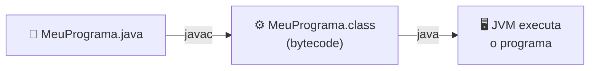

> 📁 **Exemplo completo:** [`Introdução/Main.java`](Introdução/Main.java)

### Sintaxe básica

Vamos usar esse código de exemplo:

```java
public class Main {
    public static void main(String[] args) {
        System.out.println("Hello, World!");
    }
}
```

A classe `Main` é a definição de uma classe em Java. Em Java, tudo precisa estar dentro de uma classe, mesmo o código que é executado. O nome da classe deve ser o mesmo do arquivo, ou seja, se a classe se chama `Main`, o arquivo deve ser `Main.java`. A palavra-chave `public` indica que a classe é pública e pode ser acessada por outras classes. A palavra-chave `class` é usada para definir uma nova classe.

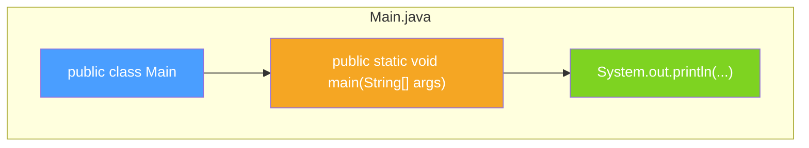

Estou utilizando um método `main` que é o ponto de entrada do programa. Ele é obrigatório em qualquer aplicação Java, e é onde o programa começa a ser executado. O método `main` tem uma assinatura específica: ele deve ser `public`, `static`, e retornar `void`. Ele também aceita um array de strings como argumento, que pode ser usado para passar parâmetros para o programa. As {} conhecidas como chaves indicam o início e o fim de um bloco de código.

> **Anatomia do `public static void main(String[] args)`:**
>
> | Parte | Significado |
> |-------|-------------|
> | `public` | Acessível de qualquer lugar |
> | `static` | Pertence à classe, não precisa de objeto |
> | `void` | Não retorna nada |
> | `main` | Nome obrigatório do ponto de entrada |
> | `String[] args` | Parâmetros passados pelo terminal |

O `System.out.println` é um método que imprime uma linha de texto no console. Ele é parte da classe `System`, que é uma classe utilitária fornecida pelo Java para realizar operações de entrada e saída, entre outras coisas. O `out`, gíria para "output", é um objeto do tipo `PrintStream` que representa a saída padrão (normalmente o console), e o `println`, gíria para "print line", é um método desse objeto que imprime o texto seguido de uma nova linha. Ou seja, várias etapas para recriar a função print do Python, mas é assim que o Java funciona, ele é mais detalhado e explícito.

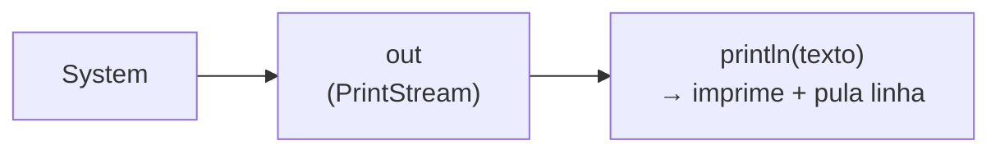

> **Comparação rápida com Python:**
>
> | Python | Java |
> |--------|------|
> | `print("Hello")` | `System.out.println("Hello");` |
> | Sem ponto e vírgula | Precisa de `;` no final |
> | Sem classe obrigatória | Tudo dentro de uma classe |
> | `python arquivo.py` | `javac Arquivo.java` + `java Arquivo` |


### Statements

Um programa de computador é simplesmente uma lista de "instruções" que são "executadas" pela máquina. Em linguagem de programação, essas "instruções" são chamadas de "statements". Um statement é uma linha de código que realiza uma ação específica. Por exemplo, em Java, a linha `System.out.println("Hello, World!");` é um statement que imprime "Hello, World!" no console.

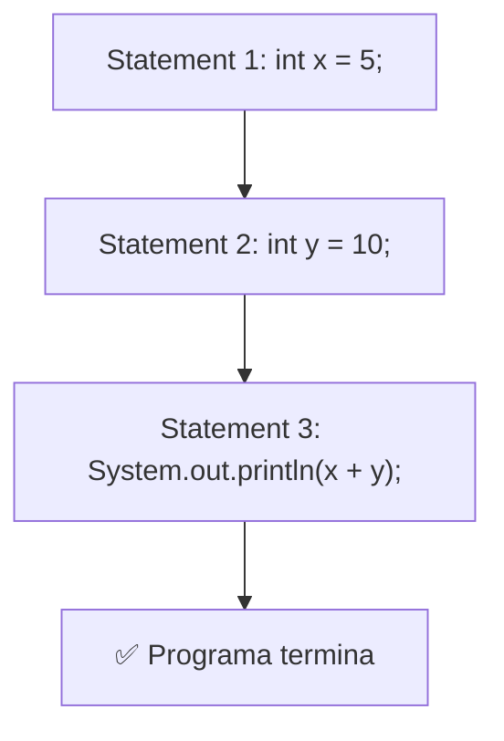

Um detalhe importante, os statements em Java terminam com um ponto e vírgula (`;`). Isso é diferente de algumas outras linguagens, como Python, onde os statements não precisam de um terminador específico. O ponto e vírgula é usado para indicar o final de um statement, permitindo que o compilador saiba onde uma instrução termina e a próxima começa. Se você esquecer de colocar o ponto e vírgula no final de um statement, o compilador vai gerar um erro, porque ele não vai conseguir entender onde o statement termina.

> **Regra de ouro:**
> ```
> Linguagem humana:  "Olá mundo."
> Java:              System.out.println("Olá mundo");
>                                                    ↑
>                                               ponto e vírgula = ponto final da frase
> ```

Imagine que um statement como uma frase na linguagem humana. Mas ao invés de utilizar "." para terminar a frase, o Java utiliza ";". Então, cada vez que você escreve um statement, é como se estivesse escrevendo uma frase, e o ponto e vírgula é o sinal de pontuação que indica o fim dessa frase. Sem ele, o Java não consegue entender onde a frase termina, e isso causa um erro de sintaxe.

---

## Fundamentos

> 📁 **Exemplos deste tópico:** [`Fundamentos/`](Fundamentos/)

Agora que já sabemos compilar e rodar um programa Java, é hora de aprender os blocos fundamentais da linguagem: variáveis, tipos de dados, operadores, strings, a classe Math, booleanos e arrays. Esses conceitos são a base de tudo que vem depois.

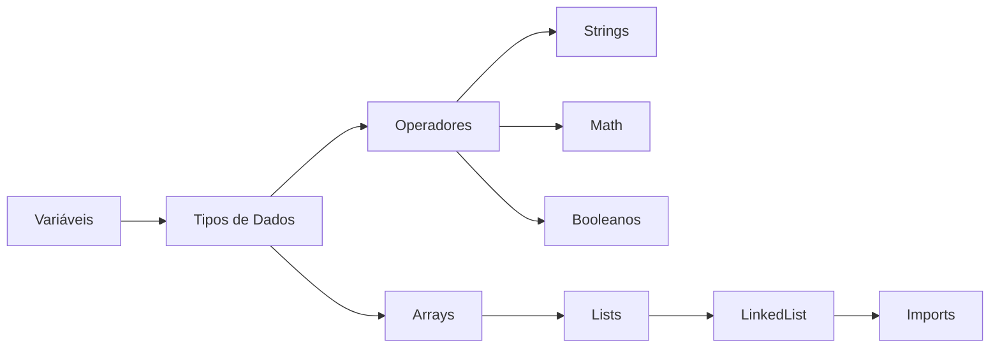

### Variáveis

Em Java, toda variável precisa ter um **tipo declarado**. Isso é bem diferente de Python, onde o tipo é inferido automaticamente. A sintaxe é:

```
tipo nomeDaVariavel = valor;
```

> 📁 **Arquivo:** [`Fundamentos/Variaveis.java`](Fundamentos/Variaveis.java)

```java
// String: armazena texto (sempre entre aspas duplas)
String nome = "Nicolau";

// int: armazena números inteiros
int idade = 22;

// double: armazena números decimais (ponto flutuante)
double altura = 1.75;

// char: armazena UM único caractere (sempre entre aspas simples)
char inicial = 'N';

// boolean: armazena verdadeiro ou falso
boolean estudante = true;
```

Variáveis podem ser **reatribuídas** (mudar de valor):

```java
idade = 23; // Ok, mudou o valor

// Declarar sem inicializar e atribuir depois
String cidade;
cidade = "São Paulo";

// Declarar múltiplas variáveis do mesmo tipo
int x = 5, y = 10, z = 15;
```

> **Regra:** variáveis declaradas com `final` viram **constantes** e não podem ser alteradas:
> ```java
> final double PI = 3.14159;
> PI = 3.14; // ❌ ERRO! Não pode reatribuir constante
> ```

### Tipos de Dados

Java tem dois grupos de tipos: **primitivos** (valores diretos na memória) e **referência** (endereços de objetos como `String`, arrays, etc.).

> 📁 **Arquivo:** [`Fundamentos/Tipos_de_dados.java`](Fundamentos/Tipos_de_dados.java)

#### Os 8 tipos primitivos

| Tipo | Tamanho | Faixa de valores | Exemplo |
|------|---------|-------------------|---------|
| `byte` | 1 byte | -128 a 127 | `byte b = 127;` |
| `short` | 2 bytes | -32.768 a 32.767 | `short s = 32000;` |
| `int` | 4 bytes | -2 bi a 2 bi | `int i = 2000000000;` |
| `long` | 8 bytes | número gigante | `long l = 9000000000L;` |
| `float` | 4 bytes | ~7 dígitos decimais | `float f = 3.14f;` |
| `double` | 8 bytes | ~15 dígitos decimais | `double d = 3.14159;` |
| `char` | 2 bytes | 1 caractere Unicode | `char c = 'A';` |
| `boolean` | 1 bit | true ou false | `boolean b = true;` |

> **Detalhe:** `String` **não é primitivo** — é um objeto (tipo referência).

#### Casting (conversão de tipos)


| Direção | Nome | O que faz | Exemplo |
|---------|------|-----------|---------|
| → Widening | Automático | Tipo menor → tipo maior | `double d = meuInt;` |
| ← Narrowing | Manual | Tipo maior → tipo menor | `int i = (int) meuDouble;` |

```java
// Widening (automático): int → double
int numInteiro = 100;
double numDecimal = numInteiro; // 100.0

// Narrowing (manual): double → int
double preco = 9.99;
int precoInteiro = (int) preco; // 9 (perde a parte decimal!)
```

### Operadores

Os operadores são os símbolos que usamos para fazer operações com variáveis e valores. Java tem 4 grupos principais:

> 📁 **Arquivo:** [`Fundamentos/Operadores.java`](Fundamentos/Operadores.java)

#### Aritméticos

| Operador | Nome | Exemplo | Resultado |
|----------|------|---------|-----------|
| `+` | Soma | `10 + 3` | `13` |
| `-` | Subtração | `10 - 3` | `7` |
| `*` | Multiplicação | `10 * 3` | `30` |
| `/` | Divisão | `10 / 3` | `3` (inteira!) |
| `%` | Módulo (resto) | `10 % 3` | `1` |
| `++` | Incremento | `x++` | `x + 1` |
| `--` | Decremento | `x--` | `x - 1` |

#### Atribuição

| Operador | Exemplo | Equivale a |
|----------|---------|------------|
| `=` | `x = 5` | `x = 5` |
| `+=` | `x += 3` | `x = x + 3` |
| `-=` | `x -= 3` | `x = x - 3` |
| `*=` | `x *= 3` | `x = x * 3` |
| `/=` | `x /= 3` | `x = x / 3` |
| `%=` | `x %= 3` | `x = x % 3` |

#### Comparação

| Operador | Nome | Exemplo | Resultado |
|----------|------|---------|-----------|
| `==` | Igual | `10 == 20` | `false` |
| `!=` | Diferente | `10 != 20` | `true` |
| `>` | Maior | `10 > 20` | `false` |
| `<` | Menor | `10 < 20` | `true` |
| `>=` | Maior ou igual | `10 >= 20` | `false` |
| `<=` | Menor ou igual | `10 <= 20` | `true` |

#### Lógicos

| Operador | Nome | Descrição | Exemplo |
|----------|------|-----------|---------|
| `&&` | AND | Ambos true? | `true && false → false` |
| `\|\|` | OR | Pelo menos um true? | `true \|\| false → true` |
| `!` | NOT | Inverte o valor | `!true → false` |

### Strings

`String` é um dos tipos mais usados em Java. Apesar de parecer um tipo primitivo, ela é na verdade um **objeto**, e por isso vem com vários métodos prontos pra manipular texto.

> 📁 **Arquivo:** [`Fundamentos/Strings_em_java.java`](Fundamentos/Strings_em_java.java)

```java
String saudacao = "Olá, Mundo!";
```

#### Métodos mais usados

| Método | O que faz | Exemplo | Resultado |
|--------|-----------|---------|-----------|
| `length()` | Tamanho da string | `"Olá".length()` | `3` |
| `toUpperCase()` | Tudo maiúsculo | `"olá".toUpperCase()` | `"OLÁ"` |
| `toLowerCase()` | Tudo minúsculo | `"OLÁ".toLowerCase()` | `"olá"` |
| `indexOf()` | Posição de um trecho | `"Olá Mundo".indexOf("Mundo")` | `4` |
| `contains()` | Contém o trecho? | `"Java".contains("av")` | `true` |
| `charAt()` | Caractere na posição | `"Java".charAt(0)` | `'J'` |
| `substring()` | Extrai trecho | `"Java".substring(1, 3)` | `"av"` |
| `replace()` | Substitui trecho | `"Olá Mundo".replace("Mundo", "Java")` | `"Olá Java"` |
| `trim()` | Remove espaços das pontas | `"  oi  ".trim()` | `"oi"` |
| `split()` | Quebra em array | `"a,b,c".split(",")` | `["a","b","c"]` |

#### Concatenação

```java
String nome = "Nicolau";
int idade = 22;

// Jeito 1: operador +
System.out.println(nome + " tem " + idade + " anos");

// Jeito 2: concat()
System.out.println(nome.concat(" é estudante"));
```

#### Comparando Strings

> **Importante:** nunca use `==` para comparar Strings! Use `equals()` ou `equalsIgnoreCase()`.

```java
String a = "Java";
String b = "java";
a.equals(b);            // false (case sensitive)
a.equalsIgnoreCase(b);  // true
```

### Math

A classe `Math` já vem pronta no Java e não precisa importar nada. Todos os métodos são `static`, então chamamos direto com `Math.metodo()`.

> 📁 **Arquivo:** [`Fundamentos/Math_em_java.java`](Fundamentos/Math_em_java.java)

| Método | O que faz | Exemplo | Resultado |
|--------|-----------|---------|-----------|
| `Math.max(a, b)` | Maior entre dois | `Math.max(10, 20)` | `20` |
| `Math.min(a, b)` | Menor entre dois | `Math.min(10, 20)` | `10` |
| `Math.abs(x)` | Valor absoluto | `Math.abs(-15)` | `15` |
| `Math.round(x)` | Arredonda | `Math.round(4.7)` | `5` |
| `Math.ceil(x)` | Arredonda pra cima | `Math.ceil(4.1)` | `5.0` |
| `Math.floor(x)` | Arredonda pra baixo | `Math.floor(4.9)` | `4.0` |
| `Math.pow(a, b)` | Potência (a^b) | `Math.pow(2, 3)` | `8.0` |
| `Math.sqrt(x)` | Raiz quadrada | `Math.sqrt(64)` | `8.0` |
| `Math.random()` | Aleatório [0, 1) | `Math.random()` | `0.xxx` |

#### Constantes

```java
Math.PI  // 3.141592653589793
Math.E   // 2.718281828459045
```

#### Gerando números aleatórios

```java
// Aleatório entre 0 e 100
int aleatorio = (int)(Math.random() * 101);

// Aleatório entre min e max (ex: 1 a 10)
int min = 1, max = 10;
int entre = (int)(Math.random() * (max - min + 1)) + min;
```

### Booleanos

O tipo `boolean` só tem dois valores possíveis: `true` ou `false`. É a base de todas as decisões no código.

> 📁 **Arquivo:** [`Fundamentos/Booleanos.java`](Fundamentos/Booleanos.java)

```java
boolean javaEhLegal = true;
boolean pythonEhIgual = false;
```

Qualquer **expressão de comparação** retorna um boolean:

```java
int idade = 22;
System.out.println(idade > 18);   // true
System.out.println(idade == 30);  // false
```

Booleanos são fundamentais pra usar em **condições** (`if`, `while`, etc.):

```java
boolean maiorDeIdade = idade >= 18;

if (maiorDeIdade) {
    System.out.println("Pode entrar!");
}
```

### Arrays

Array é uma estrutura que armazena **múltiplos valores do mesmo tipo** em posições numeradas (índices começam em 0).

> 📁 **Arquivo:** [`Fundamentos/Arrays_em_java.java`](Fundamentos/Arrays_em_java.java)

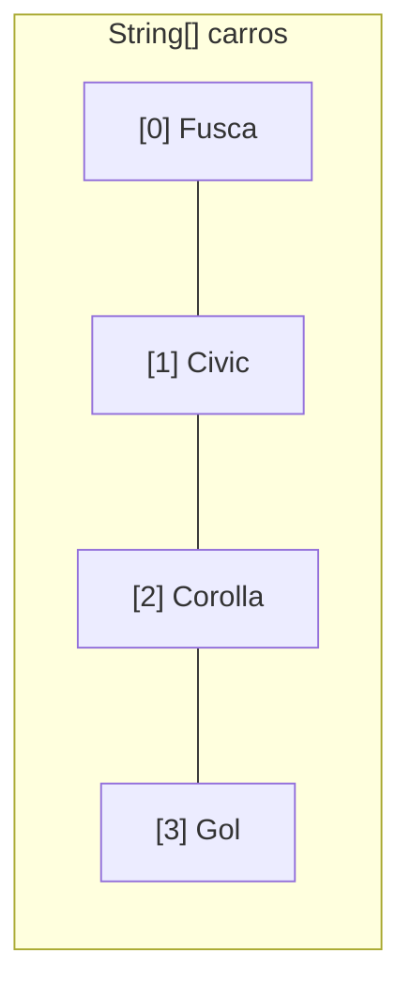

#### Criando arrays

```java
// Jeito 1: com valores
String[] carros = {"Fusca", "Civic", "Corolla", "Gol"};

// Jeito 2: declarar tamanho e preencher depois
int[] notas = new int[4];
notas[0] = 85;
notas[1] = 92;
```

#### Acessando e modificando

```java
System.out.println(carros[0]);    // Fusca
System.out.println(carros.length); // 4
carros[0] = "Kombi";              // Trocou Fusca por Kombi
```

#### Percorrendo arrays

```java
// For normal (quando precisa do índice)
for (int i = 0; i < carros.length; i++) {
    System.out.println("Posição " + i + ": " + carros[i]);
}

// For-each (mais limpo quando não precisa do índice)
for (String carro : carros) {
    System.out.println("Carro: " + carro);
}
```

#### Array multidimensional (matriz)

```java
int[][] matriz = {
    {1, 2, 3},
    {4, 5, 6},
    {7, 8, 9}
};

for (int i = 0; i < matriz.length; i++) {
    for (int j = 0; j < matriz[i].length; j++) {
        System.out.print(matriz[i][j] + " ");
    }
    System.out.println();
}
```

#### Métodos úteis (`java.util.Arrays`)

```java
import java.util.Arrays;

int[] numeros = {5, 2, 8, 1, 9, 3};
Arrays.sort(numeros);                         // Ordena: [1, 2, 3, 5, 8, 9]
System.out.println(Arrays.toString(numeros)); // Imprime bonito
int indice = Arrays.binarySearch(numeros, 5); // Busca (precisa estar ordenado)
```

### Lists

Arrays são ótimos, mas têm um problema: o tamanho é **fixo**. Se você criou um array de 4 posições, ele vai ter 4 posições pra sempre. E se você precisar adicionar mais um item? Criar um array novo, copiar tudo... é trabalhoso. Pra resolver isso, o Java tem as **Lists**, estruturas de dados **dinâmicas** que crescem e diminuem conforme a necessidade.

A implementação mais comum é o `ArrayList`, que fica no pacote `java.util`.

> 📁 **Arquivo:** [`Fundamentos/Lists_em_java.java`](Fundamentos/Lists_em_java.java)

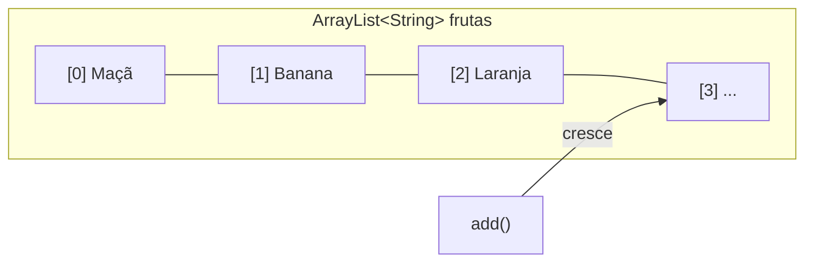

#### Criando Lists

```java
import java.util.ArrayList;
import java.util.List;

// Jeito 1: ArrayList direto
ArrayList<String> frutas = new ArrayList<>();
frutas.add("Maçã");
frutas.add("Banana");
frutas.add("Laranja");

// Jeito 2: usando a interface List (boa prática)
List<Integer> numeros = new ArrayList<>();
numeros.add(10);
numeros.add(20);
```

> **Detalhe importante:** Lists não aceitam tipos primitivos (`int`, `double`, etc.). Usamos as **Wrapper Classes**:
>
> | Primitivo | Wrapper |
> |-----------|---------|
> | `int` | `Integer` |
> | `double` | `Double` |
> | `boolean` | `Boolean` |
> | `char` | `Character` |
>
> O Java faz a conversão automaticamente (autoboxing/unboxing):
> ```java
> List<Integer> nums = new ArrayList<>();
> nums.add(42);          // autoboxing: int → Integer
> int valor = nums.get(0); // unboxing: Integer → int
> ```

#### Métodos mais usados

| Método | O que faz | Exemplo | Resultado |
|--------|-----------|---------|-----------|
| `add(item)` | Adiciona no final | `frutas.add("Uva")` | `[..., Uva]` |
| `add(pos, item)` | Adiciona na posição | `frutas.add(1, "Manga")` | Insere na pos 1 |
| `get(pos)` | Acessa pelo índice | `frutas.get(0)` | `"Maçã"` |
| `set(pos, item)` | Substitui na posição | `frutas.set(0, "Pera")` | Troca o primeiro |
| `remove(item)` | Remove pelo valor | `frutas.remove("Banana")` | Remove Banana |
| `remove(pos)` | Remove pelo índice | `frutas.remove(0)` | Remove o primeiro |
| `size()` | Tamanho da lista | `frutas.size()` | `3` |
| `contains(item)` | Contém o item? | `frutas.contains("Uva")` | `true` / `false` |
| `indexOf(item)` | Posição do item | `frutas.indexOf("Uva")` | `2` (ou `-1`) |
| `isEmpty()` | Está vazia? | `frutas.isEmpty()` | `true` / `false` |
| `clear()` | Remove tudo | `frutas.clear()` | `[]` |

#### Percorrendo Lists

```java
// For normal (quando precisa do índice)
for (int i = 0; i < frutas.size(); i++) {
    System.out.println("Posição " + i + ": " + frutas.get(i));
}

// For-each (mais limpo)
for (String fruta : frutas) {
    System.out.println("Fruta: " + fruta);
}
```

#### Métodos úteis (`java.util.Collections`)

```java
import java.util.Collections;

List<Integer> nums = new ArrayList<>();
// ... adicionar valores ...

Collections.sort(nums);       // Ordena
Collections.reverse(nums);    // Inverte
Collections.min(nums);        // Menor valor
Collections.max(nums);        // Maior valor
```

#### Array vs List

> | | Array | List (ArrayList) |
> |---|---|---|
> | Tamanho | **Fixo** (definido na criação) | **Dinâmico** (cresce/diminui) |
> | Sintaxe | `String[] arr = new String[3];` | `List<String> list = new ArrayList<>();` |
> | Acessar | `arr[0]` | `list.get(0)` |
> | Tamanho | `arr.length` | `list.size()` |
> | Adicionar | Não dá (tamanho fixo) | `list.add("item")` |
> | Remover | Não dá (tamanho fixo) | `list.remove("item")` |
> | Tipos primitivos | ✅ Aceita (`int[]`) | ❌ Só Wrapper (`Integer`) |
> | Performance | Mais rápido | Um pouco mais lento |

> **Quando usar cada um?**
> - **Array:** quando o tamanho é conhecido e fixo (ex: dias da semana, meses do ano)
> - **List:** quando o tamanho pode variar (ex: lista de usuários, carrinho de compras)

### LinkedList

A `LinkedList` é outra implementação da interface `List`, mas funciona de um jeito totalmente diferente do `ArrayList`. Enquanto o ArrayList usa um **array interno** (acesso rápido por índice), a LinkedList usa **nós encadeados** — cada elemento aponta para o próximo e o anterior, como uma corrente.

A grande vantagem: inserir e remover elementos nas **pontas** (início/fim) é muito rápido. A desvantagem: acessar um elemento pelo índice é lento, porque precisa percorrer a corrente nó por nó.

Além de ser uma List, a LinkedList também implementa a interface `Deque` (fila de duas pontas), o que permite usá-la como **fila** (FIFO) ou **pilha** (LIFO).

> 📁 **Arquivo:** [`Fundamentos/LinkedList_em_java.java`](Fundamentos/LinkedList_em_java.java)

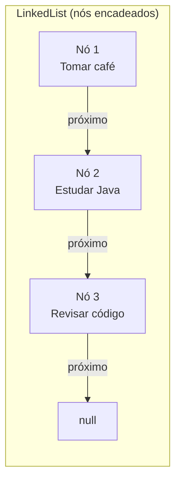

#### Criando e usando

```java
import java.util.LinkedList;

LinkedList<String> tarefas = new LinkedList<>();
tarefas.add("Estudar Java");
tarefas.add("Fazer exercícios");
tarefas.add("Revisar código");
```

#### Métodos exclusivos da LinkedList

Estes métodos **não existem** no ArrayList:

| Método | O que faz | Exemplo |
|--------|-----------|---------|
| `addFirst(item)` | Adiciona no início | `tarefas.addFirst("Café")` |
| `addLast(item)` | Adiciona no final | `tarefas.addLast("Dormir")` |
| `getFirst()` | Acessa o primeiro | `tarefas.getFirst()` |
| `getLast()` | Acessa o último | `tarefas.getLast()` |
| `removeFirst()` | Remove o primeiro | `tarefas.removeFirst()` |
| `removeLast()` | Remove o último | `tarefas.removeLast()` |

#### Usando como Fila (Queue — FIFO)

FIFO = **First In, First Out** (primeiro a entrar, primeiro a sair). Como uma fila de banco.

```java
LinkedList<String> fila = new LinkedList<>();
fila.offer("Cliente 1");    // Entra no final
fila.offer("Cliente 2");

fila.peek();                 // Olha o primeiro SEM remover → "Cliente 1"
String atendido = fila.poll(); // Remove e retorna o primeiro → "Cliente 1"
```

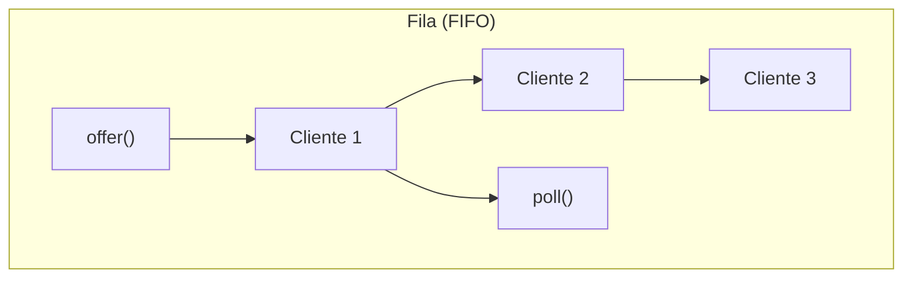

#### Usando como Pilha (Stack — LIFO)

LIFO = **Last In, First Out** (último a entrar, primeiro a sair). Como uma pilha de pratos.

```java
LinkedList<String> pilha = new LinkedList<>();
pilha.push("Página 1");     // Empilha (adiciona no topo)
pilha.push("Página 2");
pilha.push("Página 3");

pilha.peek();                // Olha o topo → "Página 3"
String removida = pilha.pop(); // Desempilha → "Página 3"
```

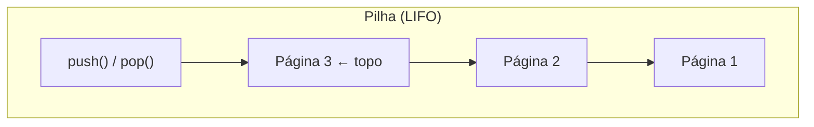

#### ArrayList vs LinkedList

> | | ArrayList | LinkedList |
> |---|---|---|
> | Estrutura interna | Array redimensionável | Nós encadeados (duplamente) |
> | Acesso por índice (`get`) | ⚡ Rápido (O(1)) | 🐢 Lento (O(n)) |
> | Inserir/remover no meio | 🐢 Lento (move elementos) | ⚡ Rápido (ajusta ponteiros) |
> | Inserir/remover nas pontas | 🐢 No início é lento | ⚡ Rápido (O(1)) |
> | Memória | Menos (só os dados) | Mais (dados + ponteiros) |
> | Usar como Fila/Pilha | ❌ Não é ideal | ✅ Perfeito |

> **Quando usar cada um?**
> - **ArrayList:** maioria dos casos. Acesso rápido, iteração eficiente. Use quando o principal é **ler** dados.
> - **LinkedList:** quando o principal é **inserir/remover** frequentemente, especialmente nas pontas. Ou quando precisa de fila/pilha.

> **Nota:** "LinkedArray" não existe em Java. O que existe é `ArrayList` (array + list) e `LinkedList` (lista encadeada). São as duas implementações mais comuns da interface `List`.

### Imports

Quando a gente usou `Arrays.sort()` ali em cima, teve que colocar `import java.util.Arrays;` no topo do arquivo. Isso é porque nem tudo em Java vem "de graça" — a maioria das classes precisa ser **importada** antes de usar.

> 📁 **Arquivo:** [`Fundamentos/Imports.java`](Fundamentos/Imports.java)

#### Como funciona

O Java organiza suas classes em **pacotes** (packages). Um pacote é basicamente uma pasta que agrupa classes relacionadas. Pra usar uma classe que não tá no seu pacote atual, você precisa dizer pro Java onde encontrar ela com a palavra-chave `import`.

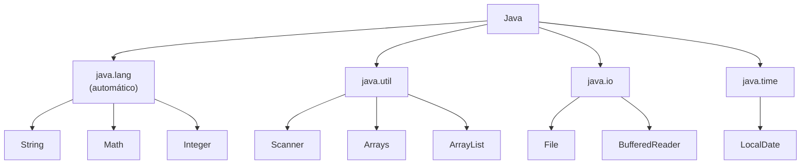

A sintaxe é simples — o `import` fica **antes** da classe e **depois** do `package` (se tiver):

```java
import java.util.Scanner;    // Importa só o Scanner
import java.util.Arrays;     // Importa só o Arrays
import java.time.LocalDate;  // Importa só o LocalDate
```

#### Wildcard (importar tudo de um pacote)

Se você vai usar **várias classes** do mesmo pacote, pode importar todas de uma vez com o `*`:

```java
import java.util.*;  // Importa TUDO de java.util (Scanner, Arrays, ArrayList, etc.)
```

> **Classe específica vs Wildcard:**
>
> | Forma | Exemplo | Quando usar |
> |-------|---------|-------------|
> | Específica | `import java.util.Scanner;` | Usa 1-2 classes do pacote (mais claro) |
> | Wildcard | `import java.util.*;` | Usa muitas classes do mesmo pacote |

#### O pacote `java.lang` — o VIP

O pacote `java.lang` é o **único** que não precisa de import. Ele é importado automaticamente em todo programa Java. Por isso que a gente usa `String`, `Math`, `System`, `Integer`, etc., sem importar nada:

```java
// Tudo isso funciona SEM import:
String nome = "Nicolau";          // java.lang.String
int numero = Integer.parseInt("42"); // java.lang.Integer
double raiz = Math.sqrt(64);     // java.lang.Math
System.out.println("Oi");        // java.lang.System
```

#### Pacotes mais comuns

| Pacote | O que tem | Exemplo de classe |
|--------|-----------|-------------------|
| `java.lang` | Básico (auto-importado) | `String`, `Math`, `System`, `Integer` |
| `java.util` | Utilitários e coleções | `Scanner`, `Arrays`, `ArrayList`, `HashMap` |
| `java.io` | Entrada/saída de arquivos | `File`, `BufferedReader`, `FileWriter` |
| `java.time` | Data e hora | `LocalDate`, `LocalTime`, `LocalDateTime` |
| `java.math` | Precisão numérica | `BigDecimal`, `BigInteger` |

> **Comparação com Python:**
>
> | Python | Java |
> |--------|------|
> | `import math` | `import java.lang.Math;` (desnecessário, já auto-importa) |
> | `from os import path` | `import java.io.File;` |
> | `import *` (evitar) | `import java.util.*;` (aceitável) |

---

## Controle de Fluxo

> 📁 **Exemplos deste tópico:** [`Controle de fluxo/`](Controle%20de%20fluxo/)

Controle de fluxo é o que faz o programa tomar decisões e repetir ações. Sem isso, o código seria só uma sequência reta de instruções.

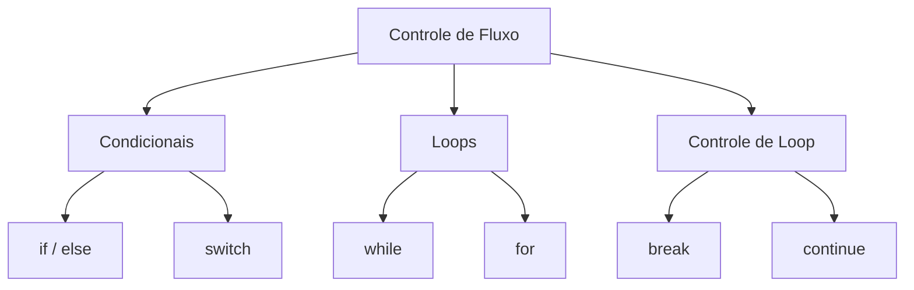

### If Else

A estrutura `if` executa um bloco de código **se** a condição for `true`. O `else` trata o caso contrário.

> 📁 **Arquivo:** [`Controle de fluxo/If_else.java`](Controle%20de%20fluxo/If_else.java)

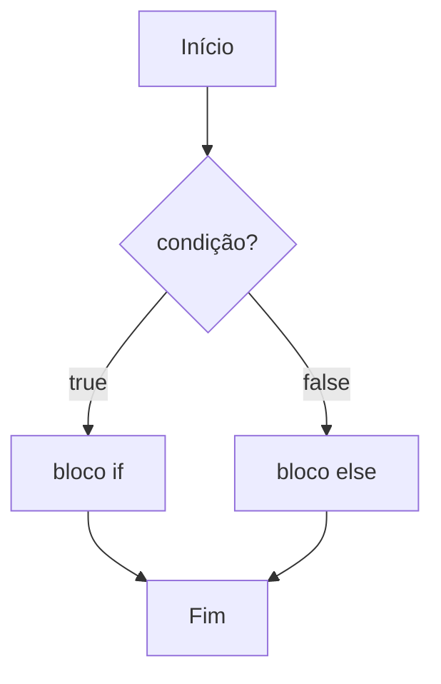

#### If simples

```java
int hora = 14;
if (hora < 12) {
    System.out.println("Bom dia!");
}
```

#### If-Else

```java
int idade = 17;
if (idade >= 18) {
    System.out.println("Maior de idade");
} else {
    System.out.println("Menor de idade");
}
```

#### Else If (encadeado)

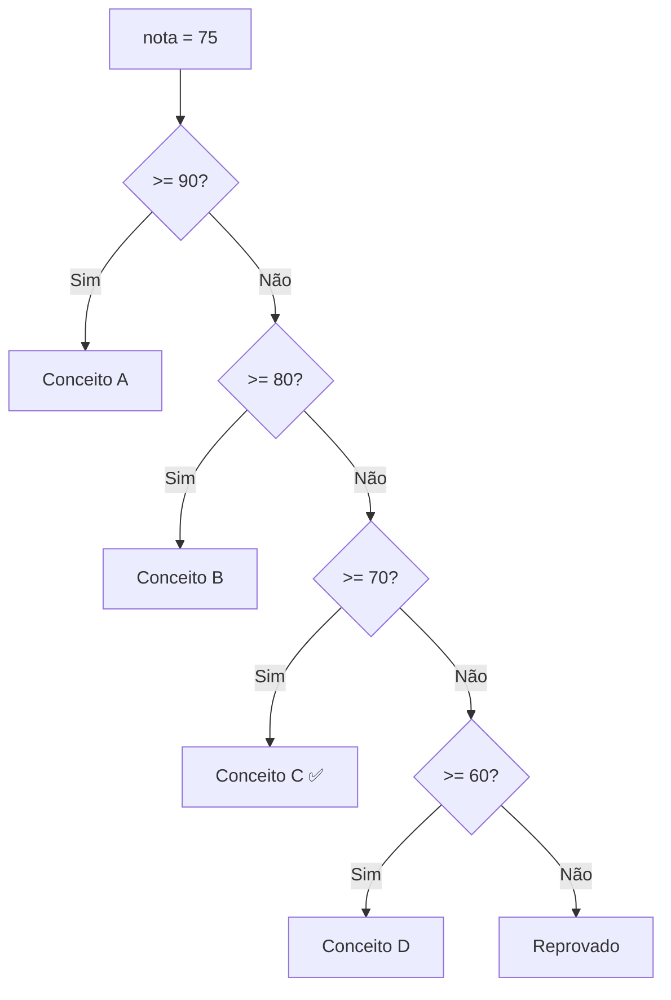

```java
int nota = 75;
if (nota >= 90) {
    System.out.println("Conceito A");
} else if (nota >= 80) {
    System.out.println("Conceito B");
} else if (nota >= 70) {
    System.out.println("Conceito C");
} else if (nota >= 60) {
    System.out.println("Conceito D");
} else {
    System.out.println("Reprovado");
}
```

#### Operador Ternário

Um `if-else` em uma única linha:

```java
// Sintaxe: variavel = (condição) ? valorSeTrue : valorSeFalse;
String resultado = (idade >= 18) ? "Maior" : "Menor";
```

### Switch

O `switch` é uma alternativa ao `if-else` quando você compara uma variável contra vários valores possíveis. Mais limpo e legível.

> 📁 **Arquivo:** [`Controle de fluxo/Switch_case.java`](Controle%20de%20fluxo/Switch_case.java)

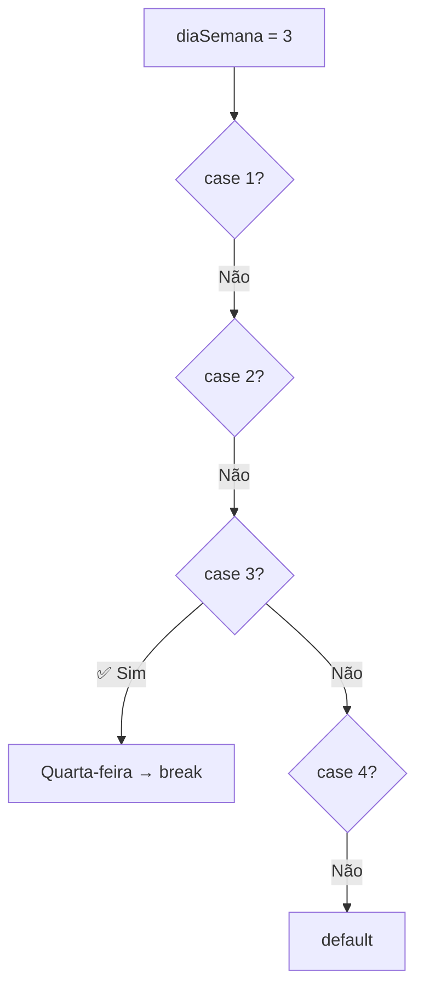

```java
int diaSemana = 3;
switch (diaSemana) {
    case 1:
        System.out.println("Segunda-feira");
        break;
    case 2:
        System.out.println("Terça-feira");
        break;
    case 3:
        System.out.println("Quarta-feira");
        break;
    // ... mais cases
    default:
        System.out.println("Dia inválido");
        break;
}
```

> **Importante:** sem o `break`, o Java executa todos os cases abaixo do que bateu (isso se chama *fall-through*).

O `switch` aceita: `int`, `byte`, `short`, `char`, `String` e `enum`.

### While Loop

O `while` repete um bloco **enquanto** a condição for `true`. Cuidado: se a condição nunca virar `false`, vira loop infinito!

> 📁 **Arquivo:** [`Controle de fluxo/While_loop.java`](Controle%20de%20fluxo/While_loop.java)

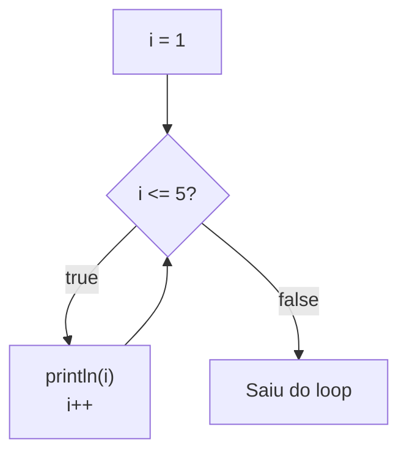

```java
int i = 1;
while (i <= 5) {
    System.out.println("Contando: " + i);
    i++; // Sem isso → loop infinito!
}
```

#### Do-While

A diferença do `do-while` é que ele executa o bloco **pelo menos uma vez**, porque a condição é verificada **depois** da execução.

```java
int x = 100;
do {
    System.out.println("Executou pelo menos uma vez! x = " + x);
} while (x < 5); // false desde o início, mas rodou 1 vez
```

> **While vs Do-While:**
>
> | Tipo | Verifica quando? | Executa mínimo |
> |------|-------------------|----------------|
> | `while` | **Antes** de executar | 0 vezes |
> | `do-while` | **Depois** de executar | 1 vez |

### For Loop

O `for` é usado quando você **sabe quantas vezes** quer repetir. A sintaxe já inclui inicialização, condição e incremento tudo numa linha.

> 📁 **Arquivo:** [`Controle de fluxo/For_loop.java`](Controle%20de%20fluxo/For_loop.java)

```
for (início; condição; incremento) { }
      ↓         ↓          ↓
  int i=0    i < 5        i++
```

```java
// For básico
for (int i = 1; i <= 5; i++) {
    System.out.println("Volta " + i);
}

// Contagem regressiva
for (int i = 10; i >= 0; i--) {
    System.out.print(i + " ");
}
```

#### For-Each

Mais limpo pra percorrer arrays quando não precisamos do índice:

```java
String[] frutas = {"Maçã", "Banana", "Laranja", "Manga"};
for (String fruta : frutas) {
    System.out.println("Fruta: " + fruta);
}
```

> **For vs For-Each:**
>
> | Tipo | Quando usar | Sintaxe |
> |------|------------|---------|
> | `for` | Precisa do índice ou controle fino | `for (int i = 0; i < n; i++)` |
> | `for-each` | Só quer percorrer tudo | `for (Tipo item : array)` |

#### For aninhado

Loop dentro de loop — útil pra matrizes e padrões:

```java
// Tabuada do 3
for (int i = 1; i <= 10; i++) {
    System.out.println(3 + " x " + i + " = " + (3 * i));
}
```

### Break e Continue

Dois comandos pra controlar o fluxo de dentro de um loop:

- **`break`**: para o loop inteiro e sai dele
- **`continue`**: pula a iteração atual e vai pra próxima

> 📁 **Arquivo:** [`Controle de fluxo/Break_continue.java`](Controle%20de%20fluxo/Break_continue.java)

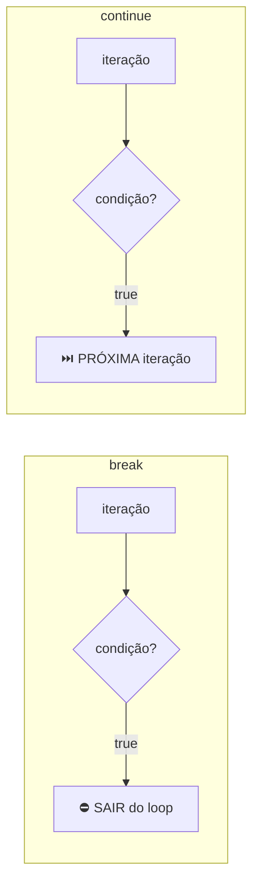

#### Break

```java
for (int i = 1; i <= 10; i++) {
    if (i == 5) {
        System.out.println("Encontrei o 5! Parando.");
        break; // Sai do loop completamente
    }
    System.out.println("Número: " + i);
}
// Saída: 1, 2, 3, 4, "Encontrei o 5!"
```

#### Continue

```java
// Imprime só os ímpares (pula os pares)
for (int i = 1; i <= 10; i++) {
    if (i % 2 == 0) {
        continue; // Pula pra próxima iteração
    }
    System.out.println("Ímpar: " + i);
}
// Saída: 1, 3, 5, 7, 9
```

#### Break no While

```java
int soma = 0, num = 1;
while (true) { // Loop "infinito" controlado pelo break
    soma += num;
    if (soma > 20) {
        System.out.println("Soma passou de 20! Soma = " + soma);
        break;
    }
    num++;
}
```

---

## Classes

Classes e objetos é o conceito fundamental da programação orientada a objetos (POO ou OOP), que é um paradigma de programação amplamente utilizado em Java. Uma classe é como um molde ou uma planta para criar objetos. Ela define as propriedades (variáveis) e comportamentos (métodos) que os objetos criados a partir dela terão.

Um jeito de se pensar é que uma classe é um template para criar objetos.

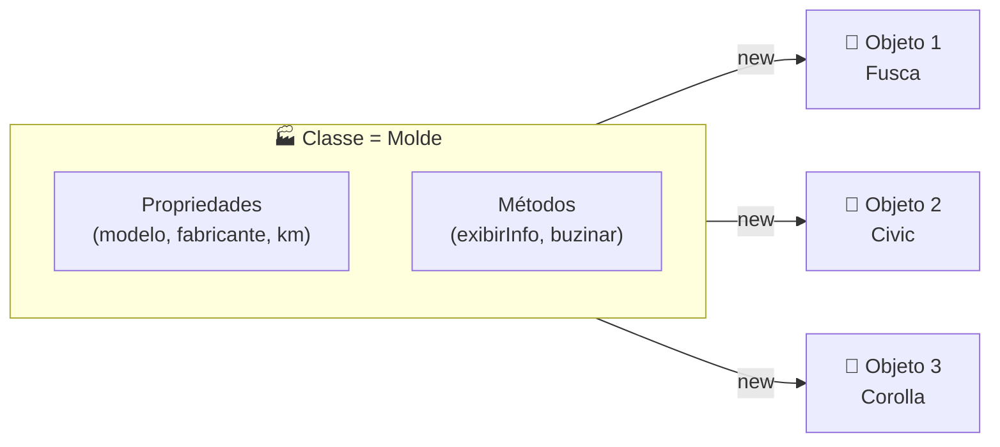

Os conceitos de OOP que vou cobrir aqui seguem essa relação:

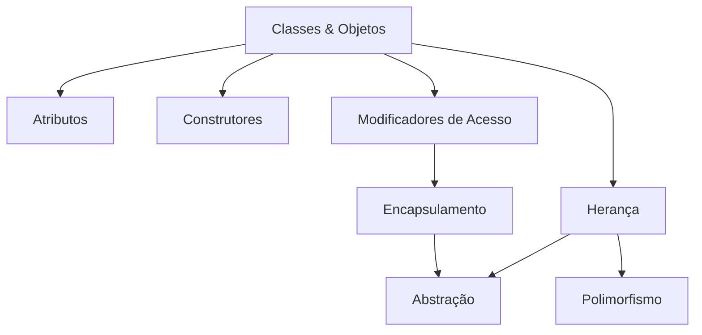

> 📁 **Exemplos deste tópico:** [`Classes/`](Classes/)

Vamos supor que eu tenha que projetar um sistema que coordena informações sobre carros. Como modelo, fabricante, kilometragem, etc. Para agilizar esse processo, eu posso criar uma classe `Carro` que define as propriedades e comportamentos comuns a todos os carros. Por exemplo:

```java
public class Carro {
    String modelo;
    String fabricante;
    int kilometragem;

    void exibirInformacoes() {
        System.out.println("Modelo: " + modelo);
        System.out.println("Fabricante: " + fabricante);
        System.out.println("Kilometragem: " + kilometragem);
    }
}
```
No exemplo acima, a classe `Carro` tem três propriedades: `modelo`, `fabricante`, e `kilometragem`. Ela também tem um método chamado `exibirInformacoes()`, que imprime as informações do carro no console. Com essa classe, eu posso criar objetos específicos de carros, como um `Carro` chamado "Fusca" da fabricante "Volkswagen" com uma kilometragem de 100.000 km.

> 📁 **Exemplo básico:** [`Classes/Basicos_da_classe.java`](Classes/Basicos_da_classe.java)

### Atributos

Atributos (ou variáveis de instância) são as propriedades que definem o estado de um objeto. Quando você cria uma classe, os atributos são as variáveis declaradas dentro dela. Cada objeto criado a partir da classe tem sua própria cópia dos atributos, ou seja, modificar o atributo de um objeto não afeta os outros.

Pra acessar ou modificar um atributo, você usa o operador ponto (`.`). Por exemplo: `carro1.modelo = "Fusca"` define o modelo do `carro1`, e `carro1.modelo` acessa esse valor. Simples assim.

O importante é entender que os objetos são independentes. Se eu mudar a kilometragem do `carro2`, a do `carro1` continua a mesma. Cada um vive na sua bolha.

> 📁 **Arquivo:** [`Classes/Atributos.java`](Classes/Atributos.java)

```java
public class Atributos {
    String modelo;
    String fabricante;
    int kilometragem;

    public static void main(String[] args) {
        Atributos carro1 = new Atributos();
        carro1.modelo = "Fusca";
        carro1.fabricante = "Volkswagen";
        carro1.kilometragem = 100000;

        Atributos carro2 = new Atributos();
        carro2.modelo = "Civic";
        carro2.fabricante = "Honda";
        carro2.kilometragem = 50000;

        System.out.println("Modelo: " + carro1.modelo);  // Fusca
        System.out.println("Modelo: " + carro2.modelo);  // Civic

        // Modificando carro2 não afeta carro1
        carro2.kilometragem = 55000;
        System.out.println(carro1.kilometragem); // 100000 (intacto)
        System.out.println(carro2.kilometragem); // 55000
    }
}
```

### Construtores

O construtor é um método especial que é chamado automaticamente quando você cria um objeto com `new`. O nome do construtor deve ser **exatamente igual** ao nome da classe, e ele **não tem tipo de retorno** (nem `void`).

A grande vantagem do construtor é que ao invés de criar o objeto e depois definir cada atributo um por um, você já passa tudo de uma vez na hora de criar. Por exemplo:

```java
Construtores carro1 = new Construtores("Fusca", "Volkswagen", 100000);
```

Dentro do construtor, usamos a palavra-chave `this` para diferenciar o atributo da classe do parâmetro que estamos recebendo. O `this.modelo` se refere ao atributo do objeto, enquanto `modelo` (sem o `this`) se refere ao parâmetro do construtor.

> 📁 **Arquivo:** [`Classes/Construtores.java`](Classes/Construtores.java)

```java
public class Construtores {
    String modelo;
    String fabricante;
    int kilometragem;

    // Construtor: mesmo nome da classe, sem tipo de retorno
    Construtores(String modelo, String fabricante, int kilometragem) {
        this.modelo = modelo;           // this.modelo = atributo do objeto
        this.fabricante = fabricante;   // modelo (sem this) = parâmetro recebido
        this.kilometragem = kilometragem;
    }

    void exibirInformacoes() {
        System.out.println("Modelo: " + modelo);
        System.out.println("Fabricante: " + fabricante);
        System.out.println("Km: " + kilometragem);
    }

    public static void main(String[] args) {
        // Tudo de uma vez, sem precisar definir atributo por atributo
        Construtores carro1 = new Construtores("Fusca", "Volkswagen", 100000);
        Construtores carro2 = new Construtores("Civic", "Honda", 50000);

        carro1.exibirInformacoes();
        carro2.exibirInformacoes();
    }
}
```

### Modificadores de Acesso

Modificadores de acesso controlam quem pode ver e usar os atributos e métodos de uma classe. Os principais são:

- **`public`**: acessível de qualquer lugar, por qualquer classe.
- **`private`**: acessível **somente** dentro da própria classe. Ninguém de fora consegue acessar diretamente.
- **`protected`**: acessível dentro do mesmo pacote e por subclasses (via herança).
- **default** (sem modificador): acessível apenas dentro do mesmo pacote.

Além dos modificadores de acesso, existem outros modificadores importantes:

- **`static`**: o atributo/método pertence à classe, não ao objeto. Todos os objetos compartilham o mesmo valor. Você acessa direto pela classe: `MinhaClasse.meuAtributo`.
- **`final`**: o valor é constante e não pode ser alterado depois de definido. Tentou mudar? O compilador reclama.

Na prática, a regra é: atributos `private` + métodos `public` (getters/setters) para acessar. Isso é a base do encapsulamento.

> 📁 **Arquivo:** [`Classes/Modificadores_de_acesso.java`](Classes/Modificadores_de_acesso.java)

| Modificador | Mesma classe | Mesmo pacote | Subclasse | Qualquer lugar |
|-------------|:---:|:---:|:---:|:---:|
| `public` | ✅ | ✅ | ✅ | ✅ |
| `protected` | ✅ | ✅ | ✅ | ❌ |
| default | ✅ | ✅ | ❌ | ❌ |
| `private` | ✅ | ❌ | ❌ | ❌ |

```java
public class Modificadores_de_acesso {
    public String nome = "Nicolau";       // Qualquer classe acessa
    private int idade = 22;                // Só essa classe acessa
    protected String cidade = "São Paulo"; // Mesmo pacote + subclasses
    String pais = "Brasil";                // Mesmo pacote (default)

    static String especie = "Humano";      // Pertence à classe, não ao objeto
    final String tipo = "Estudante";       // Constante, não pode mudar

    // Getter: jeito público de acessar um atributo privado
    public int getIdade() {
        return idade;
    }

    public static void main(String[] args) {
        Modificadores_de_acesso pessoa = new Modificadores_de_acesso();

        System.out.println(pessoa.nome);       // OK, é public
        // System.out.println(pessoa.idade);    // ERRO! é private
        System.out.println(pessoa.getIdade());  // OK, acessa via getter

        System.out.println(Modificadores_de_acesso.especie); // static: acessa pela classe
        // pessoa.tipo = "Professor";           // ERRO! final não pode ser reatribuído
    }
}
```

### Encapsulamento

Encapsulamento é um dos pilares da programação orientada a objetos. A ideia é simples: **esconder os dados internos** da classe e **controlar o acesso** a eles através de métodos.

Na prática, isso significa:
- Atributos são `private` (ninguém mexe direto)
- Métodos `get` (getters) para **ler** os valores
- Métodos `set` (setters) para **alterar** os valores

A grande sacada é que nos setters você pode colocar **validações**. Por exemplo, impedir que alguém defina uma idade negativa ou um salário abaixo de zero. Em vez de confiar em quem usa a classe, você controla tudo dentro dela. É como ter uma porta com tranca: o dado está lá dentro, mas só entra quem segue as regras.

```mermaid
flowchart LR
    EXT["🌍 Código externo"] -->|"setIdade(25)"| SET["✅ Setter\n(valida)"]
    SET --> PRIV["🔒 private idade"]
    PRIV --> GET["📖 Getter"]
    GET -->|"getIdade()"| EXT
    EXT -.-x|"objeto.idade = -5"| PRIV
```

> 📁 **Arquivo:** [`Classes/Encapsulamento.java`](Classes/Encapsulamento.java)

```java
public class Encapsulamento {
    private String nome;
    private int idade;

    Encapsulamento(String nome, int idade) {
        this.nome = nome;
        setIdade(idade); // Já valida na criação
    }

    public String getNome() { return nome; }
    public void setNome(String nome) { this.nome = nome; }

    public int getIdade() { return idade; }

    // Setter com validação: impede valores absurdos
    public void setIdade(int idade) {
        if (idade > 0 && idade < 150) {
            this.idade = idade;
        } else {
            System.out.println("Idade inválida: " + idade);
        }
    }

    public static void main(String[] args) {
        Encapsulamento pessoa = new Encapsulamento("Nicolau", 22);

        System.out.println(pessoa.getNome());  // Nicolau
        System.out.println(pessoa.getIdade()); // 22

        pessoa.setIdade(-5);                   // "Idade inválida: -5"
        System.out.println(pessoa.getIdade()); // 22 (não mudou!)
    }
}
```

### Herança

Herança é o mecanismo que permite criar uma nova classe com base em uma classe existente, herdando todos os seus atributos e métodos. A classe que é herdada é chamada de **superclasse** (ou classe pai), e a nova classe é chamada de **subclasse** (ou classe filha).

A palavra-chave `extends` é usada para indicar a herança:

```java
class Carro extends Veiculo {
    // Carro herda tudo de Veiculo e pode adicionar coisas próprias
}
```

Dentro do construtor da subclasse, usamos `super()` para chamar o construtor da classe pai e inicializar os atributos herdados. A subclasse pode usar os métodos da classe pai diretamente, como se fossem dela.

A vantagem é evitar repetição de código. Se `Carro` e `Moto` têm atributos em comum (marca, ano), coloca tudo em `Veiculo` e ambos herdam. Aí cada um adiciona só o que é específico dele.

```mermaid
classDiagram
    class Veiculo {
        String marca
        int ano
        buzinar()
        exibirInfo()
    }
    class Carro {
        int portas
    }
    class Moto {
        boolean temBau
    }
    Veiculo <|-- Carro : extends
    Veiculo <|-- Moto : extends
```

> 📁 **Arquivo:** [`Classes/Heranca.java`](Classes/Heranca.java)

```java
class Veiculo {
    String marca;
    int ano;

    Veiculo(String marca, int ano) {
        this.marca = marca;
        this.ano = ano;
    }

    void buzinar() {
        System.out.println("BEEP BEEP!");
    }
}

class Carro extends Veiculo {
    int portas;

    Carro(String marca, int ano, int portas) {
        super(marca, ano); // Chama o construtor da classe pai
        this.portas = portas;
    }
}

class Moto extends Veiculo {
    boolean temBau;

    Moto(String marca, int ano, boolean temBau) {
        super(marca, ano);
        this.temBau = temBau;
    }
}
```

**Detalhe importante:** em Java, uma classe só pode herdar de **uma** superclasse. Herança múltipla (herdar de duas classes ao mesmo tempo) não é permitida, mas isso se resolve com interfaces.

### Polimorfismo

Polimorfismo significa "muitas formas". É a capacidade de um mesmo método se comportar de maneiras diferentes dependendo de qual classe o implementa. Está diretamente ligado à herança.

Na prática: a classe pai define um método, e cada subclasse **sobrescreve** (`@Override`) esse método com sua própria versão. O Java sabe qual versão chamar com base no tipo real do objeto.

```mermaid
classDiagram
    class Animal {
        String nome
        fazerSom() "faz algum som..."
    }
    class Cachorro {
        fazerSom() "Au au!"
    }
    class Gato {
        fazerSom() "Miau!"
    }
    class Pato {
        fazerSom() "Quack!"
    }
    Animal <|-- Cachorro
    Animal <|-- Gato
    Animal <|-- Pato
```

> 📁 **Arquivo:** [`Classes/Polimorfismo.java`](Classes/Polimorfismo.java)

```java
Animal animal1 = new Cachorro("Rex");
animal1.fazerSom(); // Chama a versão de Cachorro: "Au au!"
```

Mesmo que a variável seja do tipo `Animal`, o objeto é um `Cachorro`, e o Java é inteligente o suficiente pra chamar o método correto. Isso é o **polimorfismo em tempo de execução**.

Isso é muito útil porque permite tratar objetos diferentes de forma uniforme. Você pode ter um array de `Animal[]` com cachorro, gato e pato dentro, e chamar `fazerSom()` em todos sem saber o tipo específico de cada um.

```java
class Animal {
    String nome;
    Animal(String nome) { this.nome = nome; }

    void fazerSom() {
        System.out.println(nome + " faz algum som...");
    }
}

class Cachorro extends Animal {
    Cachorro(String nome) { super(nome); }

    @Override
    void fazerSom() {
        System.out.println(nome + " faz: Au au!");
    }
}

class Gato extends Animal {
    Gato(String nome) { super(nome); }

    @Override
    void fazerSom() {
        System.out.println(nome + " faz: Miau!");
    }
}

// A mágica: variável do tipo Animal, objeto do tipo específico
Animal[] animais = { new Cachorro("Rex"), new Gato("Mimi") };
for (Animal a : animais) {
    a.fazerSom(); // Java chama a versão correta de cada um
}
// Rex faz: Au au!
// Mimi faz: Miau!
```

### Abstração

Abstração é esconder a complexidade e mostrar só o que é essencial. Em Java, usamos **classes abstratas** e **interfaces** pra isso.

```mermaid
classDiagram
    class Forma {
        <<abstract>>
        String cor
        calcularArea()* double
        exibir() void
    }
    class Desenhavel {
        <<interface>>
        desenhar() void
    }
    class Redimensionavel {
        <<interface>>
        redimensionar(fator) void
    }
    class Circulo {
        double raio
        calcularArea() double
    }
    class Retangulo {
        double largura
        double altura
        calcularArea() double
    }
    class Quadrado {
        double lado
        calcularArea() double
        desenhar() void
        redimensionar(fator) void
    }
    Forma <|-- Circulo
    Forma <|-- Retangulo
    Forma <|-- Quadrado
    Desenhavel <|.. Quadrado : implements
    Redimensionavel <|.. Quadrado : implements
```

> 📁 **Arquivo:** [`Classes/Abstracao.java`](Classes/Abstracao.java)

**Classe abstrata:**
- Não pode ser instanciada diretamente (não dá pra fazer `new Forma()`)
- Pode ter métodos abstratos (só a assinatura, sem corpo) que as subclasses são **obrigadas** a implementar
- Pode ter métodos concretos (com corpo) que são herdados normalmente

```java
abstract class Forma {
    abstract double calcularArea(); // Subclasses TÊM QUE implementar
    void exibir() { ... }          // Método concreto, herdado normalmente
}
```

**Interface:**
- É como um "contrato" que a classe se compromete a cumprir
- Todos os métodos são abstratos por padrão
- Uma classe pode implementar **múltiplas interfaces** (resolve o problema da herança múltipla!)
- Usa a palavra-chave `implements`

```java
class Quadrado extends Forma implements Desenhavel, Redimensionavel {
    // Tem que implementar calcularArea(), desenhar() e redimensionar()
}
```

A diferença entre classe abstrata e interface: a classe abstrata pode ter atributos e métodos completos, enquanto a interface é puramente um contrato de "quais métodos você precisa ter". Use classe abstrata quando as subclasses compartilham código em comum, e interface quando classes totalmente diferentes precisam seguir o mesmo contrato.

> **Resumo rápido: Classe Abstrata vs Interface**
>
> | | Classe Abstrata | Interface |
> |---|---|---|
> | Instanciar? | ❌ Não | ❌ Não |
> | Métodos concretos? | ✅ Sim | ❌ Não (só abstratos) |
> | Atributos? | ✅ Sim | ❌ Só constantes |
> | Herança múltipla? | ❌ Só uma classe | ✅ Várias interfaces |
> | Palavra-chave | `extends` | `implements` |

### Métodos de Classe

Até agora, a gente viu métodos mais como "funções soltas" na seção de Métodos. Mas dentro de uma classe, métodos têm papéis mais específicos. Aqui o foco é: **como métodos funcionam dentro de uma classe**, incluindo a diferença entre métodos de instância e métodos `static`, sobrecarga (overloading), o uso do `this`, e métodos privados.

```mermaid
flowchart TD
    MC["Métodos de Classe"] --> MI["Métodos de instância\n(precisam de objeto)"]
    MC --> MS["Métodos static\n(pertencem à classe)"]
    MC --> SO["Sobrecarga\n(mesmo nome, params diferentes)"]
    MC --> MP["Métodos privados\n(uso interno)"]
    MI --> THIS["this: referência\nao próprio objeto"]
```

> 📁 **Arquivo:** [`Classes/Metodos_de_classe.java`](Classes/Metodos_de_classe.java)

**Métodos de instância vs static:**

Métodos de **instância** precisam de um objeto pra serem chamados. Eles acessam os atributos do objeto normalmente.

Métodos **`static`** pertencem à classe, não ao objeto. São chamados pela classe diretamente e **não podem acessar** atributos de instância.

```java
class Personagem {
    String nome;
    private static int totalPersonagens = 0;

    Personagem(String nome) {
        this.nome = nome;
        totalPersonagens++;
    }

    // Método de instância: precisa de objeto
    void apresentar() {
        System.out.println("Eu sou " + nome);
    }

    // Método static: pertence à classe
    static int getTotal() {
        return totalPersonagens;
        // nome não funciona aqui! static não acessa instância
    }
}

// Uso:
Personagem p = new Personagem("Arthas");
p.apresentar();              // Método de instância: pelo objeto
Personagem.getTotal();       // Método static: pela classe
```

> | | Método de Instância | Método `static` |
> |---|---|---|
> | Precisa de objeto? | ✅ Sim | ❌ Não |
> | Acessa atributos? | ✅ Sim | ❌ Só static |
> | Como chamar? | `objeto.metodo()` | `Classe.metodo()` |
> | Exemplo | `getNome()`, `atacar()` | `main()`, `Math.sqrt()` |

**O `this` dentro de métodos:**

A palavra-chave `this` é uma referência ao **próprio objeto**. Serve pra duas coisas principais:

1. **Diferenciar atributo de parâmetro** (quando têm o mesmo nome)
2. **Chamar outros métodos** da mesma instância

```java
void apresentar() {
    // this.getNome() e getNome() são a mesma coisa aqui dentro
    System.out.println("Eu sou " + this.getNome());
}
```

**Sobrecarga de métodos (Method Overloading):**

Sobrecarga é ter **vários métodos com o mesmo nome**, mas com **parâmetros diferentes**. O Java decide qual chamar com base nos argumentos.

```java
void curar() {
    // Cura padrão
}

void curar(int bonus) {
    // Cura com bônus
}

void curar(int bonus, String fonte) {
    // Cura com bônus e origem
}

// O Java escolhe sozinho:
personagem.curar();               // chama curar()
personagem.curar(3);              // chama curar(int)
personagem.curar(2, "Poção");     // chama curar(int, String)
```

> ⚠️ **Sobrecarga ≠ Sobrescrita:**
>
> | | Sobrecarga (Overloading) | Sobrescrita (Override) |
> |---|---|---|
> | Onde? | Mesma classe | Subclasse |
> | Nome? | Mesmo | Mesmo |
> | Parâmetros? | **Diferentes** | **Iguais** |
> | Anotação? | Nenhuma | `@Override` |

**Métodos privados:**

Métodos `private` só podem ser chamados **dentro da própria classe**. São usados como métodos auxiliares internos.

```java
private int calcularDano() {
    return nivel * 10;
}

void atacar() {
    // calcularDano() é usado internamente, ninguém de fora precisa saber dele
    System.out.println(nome + " ataca com força " + calcularDano() + "!");
}

// De fora:
personagem.atacar();         // OK
personagem.calcularDano();   // ERRO! private
```

---

## Métodos

Um `método` é um bloco de codigo que roda apenas quando é chamado. Você pode passar dados, conhecidos como `parâmetros`, para um método. Um método pode retornar dados como resultado.

Além disso, métodos são conhecidos por fazer ações específicas, então eles são conhecidos também como `funções`.

Por que eu deveria utilizar métodos? Para reutilizar código, definir ele uma vez e usar quantas vezes precisar. Além de ser um ótimo e simples jeito de organizar o seu código em "código limpo"

```mermaid
flowchart LR
    MAIN["main()"] -->|chama| M1["metodo1()"]
    MAIN -->|chama| M2["metodo2()"]
    MAIN -->|chama| M3["metodo3()"]
    M1 -->|retorna| MAIN
    M2 -->|retorna| MAIN
    M3 -->|retorna| MAIN
```

> 📁 **Exemplos deste tópico:** [`Métodos e funções/`](Métodos%20e%20funções/)

### Criando um método

Um método é criado dentro de uma classe. Ele tem um nome, pode ter parâmetros, e pode retornar um valor. A sintaxe básica para criar um método em Java é a seguinte:

```java
public class MinhaClasse {
    static void meuMetodo() {
        // código do método
    }
}
```

- `MeuMetodo` é o nome do método. Você pode escolher qualquer nome que siga as regras de nomenclatura do Java.
- `static` é um modificador que indica que o método pertence à classe, e não a uma instância específica da classe. Isso significa que você pode chamar o método sem criar um objeto da classe.
- `void` é o tipo de retorno do método, indicando que ele não retorna nenhum valor. Se o método retornar um valor, você deve especificar o tipo de retorno, como `int`, `String`, etc. Vou falar  mais sobre isso em outro diretório.

> **Anatomia de um método:**
> ```
> static  void  meuMetodo  ()
>   │      │       │        │
>   │      │       │        └─ parâmetros (vazio nesse caso)
>   │      │       └───────── nome do método
>   │      └──────────────── tipo de retorno (void = nada)
>   └───────────────────── modificador (pertence à classe)
> ```

### Chamando um método

Olha o exemplo abaixo:

> 📁 **Arquivo:** [`Métodos e funções/Metodo_simples.java`](Métodos%20e%20funções/Metodo_simples.java)

```java
public class Main {
  static void myMethod() {
    System.out.println("I just got executed!"); // Cria um método simples que imprime um texto
  }

  public static void main(String[] args) {
    myMethod(); // Chama o método myMethod para executar o código dentro dele
  }
}
```

Na primeira parte, nós criamos um método chamado `myMethod` que simplesmente imprime uma mensagem no console. Ele é um método estático, o que significa que podemos chamá-lo diretamente sem precisar criar uma instância da classe `Main`.

Logo abaixo, no método `main`, que é o ponto de entrada do programa, nós chamamos `myMethod()`. Isso faz com que o código dentro de `myMethod` seja executado, e a mensagem "I just got executed!" seja impressa no console.

Lembrando que métodos podem ser chamados diversas vezes caso necessário

```java
public class Main {
  static void myMethod() {
    System.out.println("I just got executed!");
  }

  public static void main(String[] args) {
    myMethod();
    myMethod();
    myMethod();
  }
}
```

### Parâmetros e Argumentos

Informações podem ser passadas para métodos através de `parâmetros`. Parãmetros vão funcionar como váriaveis dentro do método. Parâmetros são especificados dentro dos parênteses na definição do método. Você pode ter quantos parâmetros quiser, contanto que as separe com uma vírgula. Por exemplo:

```java
public class Main {
  static void myMethod(String fname) {
    System.out.println(fname + " Refsnes");
  }

  public static void main(String[] args) {
    myMethod("Liam");
    myMethod("Jenny");
    myMethod("Anja");
  }
}
```

No método acima, criamos uma váriavel string chamada `fname` como parâmetro do método `myMethod`. Quando chamamos `myMethod`, passamos um argumento, que é o valor que queremos que o parâmetro receba. No exemplo, passamos "Liam", "Jenny", e "Anja" como argumentos para `myMethod`. O método então imprime o nome seguido de "Refsnes" no console.

---

Quando um `parâmetro` é passando para um método, ele é chamado de `argumento`. No exemplo acima, "Liam", "Jenny", e "Anja" são argumentos que estão sendo passados para o método `myMethod`.

> **Parâmetro vs Argumento:**
>
> | Conceito | O que é | Onde aparece |
> |----------|---------|-------------|
> | **Parâmetro** | A variável na definição do método | `static void myMethod(String fname)` |
> | **Argumento** | O valor passado na chamada | `myMethod("Liam")` |

```mermaid
flowchart LR
    CALL["myMethod(#quot;Liam#quot;)"] -->|Liam → fname| METHOD["static void myMethod(String fname)"]
    METHOD --> PRINT["println(fname + #quot;Refsnes#quot;)"]
    PRINT --> OUTPUT["Liam Refsnes"]
```

---

### Multiplos parâmetros

Como citado anteriormente, você pode ter quantos parâmetros quiser em um método, contanto que os separe com vírgula. Por exemplo:

> 📁 **Arquivo:** [`Métodos e funções/Multiplos_parametros.java`](Métodos%20e%20funções/Multiplos_parametros.java)

```java
public class Main {
  static void myMethod(String fname, int age) {
    System.out.println(fname + " is " + age);
  }

  public static void main(String[] args) {
    myMethod("Liam", 5);
    myMethod("Jenny", 8);
    myMethod("Anja", 31);
  }
}
```

Separamos `fname`e `age` com vírgulas, agora a função recebe 2 parâmetros, o que aumenta por consequência a quantidade de argumentos

### Métodos com decisões

> 📁 **Arquivo:** [`Métodos e funções/Metodos_com_decisoes.java`](Métodos%20e%20funções/Metodos_com_decisoes.java)

```mermaid
flowchart TD
    START["checkAge(age)"] --> IF{"age < 18?"}
    IF -->|✅ Sim| DENIED["Access denied"]
    IF -->|❌ Não| GRANTED["Access granted"]
```

```java
public class Metodos_com_decisoes {
  static void checkAge(int age) {
    if (age < 18) {
      System.out.println("Access denied - You are not old enough!");
    } else {
      System.out.println("Access granted - You are old enough!");
    }
  }
  public static void main(String[] args) {
    checkAge(20);
  }
}
```

Acima temos um método chamado `checkAge` que recebe um parâmetro inteiro `age`. Dentro do método, utilizamos uma estrutura de decisão `if-else` para verificar se a idade é menor que 18. Se for, o programa imprime "Access denied - You are not old enough!" no console. Caso contrário, ele imprime "Access granted - You are old enough!".

Não tem muito o que detalhar deste código, é só mais um exemplo de como métodos podem ser utilizados para organizar o código e realizar ações específicas, nesse caso, verificar a idade e imprimir uma mensagem apropriada.

### Return nos métodos

Métodos não precisam retornar um valor, como vimos no exemplo do `checkAge`, mas eles também podem retornar um valor. Para isso, você precisa especificar o tipo de retorno do método e usar a palavra-chave `return` para retornar o valor desejado. Por exemplo:

```mermaid
flowchart LR
    CALL["myMethod(3)"] --> CALC["return 5 + 3"]
    CALC --> RESULT["8"]
    RESULT --> PRINT["println(8)"]
```

> **`void` vs tipo de retorno:**
>
> | Tipo de retorno | O que faz | Exemplo |
> |-----------------|-----------|--------|
> | `void` | Não retorna nada, só executa | `static void checkAge(int age)` |
> | `int` | Retorna um número inteiro | `static int myMethod(int x)` |
> | `String` | Retorna um texto | `static String getName()` |
> | `boolean` | Retorna verdadeiro/falso | `static boolean isAdult(int age)` |
> | `double` | Retorna um decimal | `static double calcMedia(int a, int b)` |

> 📁 **Arquivo:** [`Métodos e funções/Return.java`](Métodos%20e%20funções/Return.java)

```java
public class Main {
  static int myMethod(int x) {
    return 5 + x;
  }

  public static void main(String[] args) {
    System.out.println(myMethod(3));
  }
}
```

No exemplo acima, o método `myMethod` tem um tipo de retorno `int`, o que significa que ele retorna um valor inteiro. Dentro do método, usamos a palavra-chave `return` para retornar o resultado da expressão `5 + x`. Quando chamamos `myMethod(3)`, ele retorna `8`, que é então impresso no console.

---

## Input de Dados

> 📁 **Exemplos deste tópico:** [`Input/`](Input/)

Até agora, todos os nossos programas só **imprimiam** coisas no console. Mas e quando a gente quer **receber** informação do usuário ou ler/escrever arquivos? O Java tem duas grandes ferramentas pra isso:

- **`Scanner`** — pra ler dados digitados pelo teclado (input do usuário)
- **I/O Streams** — pra ler e escrever dados em **arquivos** (entrada e saída de dados)

```mermaid
flowchart TD
    IO["Input / Output em Java"] --> SC["Scanner"]
    IO --> STREAMS["I/O Streams"]
    SC --> TECLADO["⌨️ Lê do teclado"]
    STREAMS --> IS["InputStream\n(lê bytes)"]
    STREAMS --> OS["OutputStream\n(escreve bytes)"]
    STREAMS --> RW["Reader / Writer\n(lê/escreve texto)"]
```

### Scanner

Pra usar o `Scanner`, primeiro você precisa **importar** ele, porque ele não faz parte do pacote padrão. A importação fica no topo do arquivo, antes da classe:

```java
import java.util.Scanner;
```

Depois, você cria um objeto `Scanner` que lê do `System.in` (a entrada padrão, ou seja, o teclado):

```java
Scanner scanner = new Scanner(System.in);
```

Agora é só usar os métodos do scanner pra ler diferentes tipos de dados:

> 📁 **Arquivo:** [`Input/Input_de_dados.java`](Input/Input_de_dados.java)

```java
import java.util.Scanner;

public class Input_de_dados {
    public static void main(String[] args) {
        Scanner scanner = new Scanner(System.in);

        System.out.print("Digite seu nome: ");
        String nome = scanner.nextLine();
        System.out.println("Olá, " + nome + "!");

        System.out.print("Digite sua idade: ");
        int idade = scanner.nextInt();
        System.out.println("Você tem " + idade + " anos.");

        scanner.close();
    }
}
```

> **Detalhe:** usamos `System.out.print()` (sem o `ln`) pra que o cursor fique na mesma linha, esperando o usuário digitar.

### Métodos do Scanner

Cada tipo de dado tem seu próprio método de leitura no Scanner:

| Método | Tipo que lê | Exemplo |
|--------|-------------|---------|
| `nextLine()` | `String` (linha inteira) | `scanner.nextLine()` |
| `next()` | `String` (uma palavra só) | `scanner.next()` |
| `nextInt()` | `int` | `scanner.nextInt()` |
| `nextDouble()` | `double` | `scanner.nextDouble()` |
| `nextFloat()` | `float` | `scanner.nextFloat()` |
| `nextLong()` | `long` | `scanner.nextLong()` |
| `nextBoolean()` | `boolean` | `scanner.nextBoolean()` |
| `nextByte()` | `byte` | `scanner.nextByte()` |
| `nextShort()` | `short` | `scanner.nextShort()` |

> **`next()` vs `nextLine()`:**
>
> | Método | O que lê | Exemplo de input: `"João Silva"` |
> |--------|----------|----------------------------------|
> | `next()` | Até o primeiro espaço | `"João"` |
> | `nextLine()` | A linha inteira | `"João Silva"` |

Depois de usar o Scanner, é boa prática **fechar** ele pra liberar recursos:

```java
scanner.close();
```

### Bug clássico: nextLine() depois de nextInt()

Esse é um dos bugs mais comuns pra quem tá começando com Java. Quando você usa `nextInt()`, `nextDouble()`, ou qualquer outro método que lê um tipo primitivo, ele **não consome** a quebra de linha (`\n`) que o usuário digitou ao apertar Enter. Aí, quando você chama `nextLine()` logo depois, ele lê essa quebra de linha vazia em vez do texto que você queria.

```mermaid
flowchart TD
    INPUT["Usuário digita: 22 ⏎"] --> NI["nextInt() lê: 22"]
    NI --> BUFFER["Buffer ainda tem: \\n"]
    BUFFER --> NL["nextLine() lê: \\n (vazio!)"]
    NL --> SKIP["❌ Pulou a leitura!"]
```

**O problema:**

```java
System.out.print("Idade: ");
int idade = scanner.nextInt();      // Lê 22, mas o \n fica no buffer

System.out.print("Cidade: ");
String cidade = scanner.nextLine(); // Lê o \n vazio! Não espera digitar
```

**A solução:** adicionar um `scanner.nextLine()` extra pra consumir o `\n` pendente:

```java
System.out.print("Idade: ");
int idade = scanner.nextInt();
scanner.nextLine(); // ← Limpa o \n do buffer

System.out.print("Cidade: ");
String cidade = scanner.nextLine(); // Agora funciona!
```

> **Regra prática:** sempre que usar `nextInt()`, `nextDouble()`, etc., e precisar de um `nextLine()` depois, coloque um `scanner.nextLine()` extra entre eles pra limpar o buffer.

---

## Organização de Projeto

> 📁 **Exemplos deste tópico:** [`Organização de projeto/`](Organização%20de%20projeto/)

Até agora, nos exemplos de herança e polimorfismo, a gente jogou várias classes no mesmo arquivo. Isso funciona, mas conforme o projeto cresce, vira uma bagunça impossível de manter. Organização é o que separa um script de estudo de um projeto real.

```mermaid
flowchart LR
    ANTES["📄 Tudo_junto.java\n(6 classes empilhadas)"] -->|refatora| DEPOIS["📁 Projeto organizado\n(1 classe por arquivo)"]
    DEPOIS --> MOD["📁 modelo/\nAnimal, Cachorro, Gato..."]
    DEPOIS --> SRV["📁 servico/\nAnimalServico"]
    DEPOIS --> MAIN["📄 Main.java"]
```

### O problema: tudo junto

Em Java, só pode ter **UMA classe pública por arquivo**, e o nome do arquivo **tem que ser igual** ao da classe pública. Classes sem `public` podem ficar no mesmo arquivo (como fizemos em Heranca.java e Polimorfismo.java), mas isso não escala.

> 📁 **Exemplo do problema:** [`Organização de projeto/Tudo_junto.java`](Organização%20de%20projeto/Tudo_junto.java)

No `Tudo_junto.java`, temos 6 classes (Animal, Cachorro, Gato, Passaro, AnimalServico e Tudo_junto) todas empilhadas num arquivo só. Funciona? Funciona. Mas imagina isso com 20, 50, 100 classes... é como guardar todas as roupas num saco só.

### Packages (pacotes)

Packages são o jeito do Java de organizar classes em grupos lógicos, como pastas no seu computador. Na prática, **um pacote corresponde a uma pasta** no sistema de arquivos.

Pra declarar que uma classe pertence a um pacote, usa a palavra-chave `package` **na primeira linha** do arquivo:

```java
package com_organizacao.modelo;

public class Animal {
    // ...
}
```

Isso significa que o arquivo `Animal.java` mora na pasta `com_organizacao/modelo/`.

### Como declarar e usar pacotes

Quando uma classe precisa usar outra que está em um pacote diferente, ela precisa **importar**:

```java
package com_organizacao;

import com_organizacao.modelo.Cachorro;  // Importa uma classe específica
import com_organizacao.modelo.Gato;
import com_organizacao.servico.AnimalServico;

public class Main {
    public static void main(String[] args) {
        AnimalServico servico = new AnimalServico(10);
        servico.adicionar(new Cachorro("Rex", "Pastor Alemão"));
        servico.adicionar(new Gato("Mimi", true));
        servico.listarTodos();
    }
}
```

> **Detalhe importante:** quando você organiza em pacotes, as classes precisam ser `public` pra serem acessíveis de outros pacotes. Lembra dos modificadores de acesso? É aqui que eles brilham.

```mermaid
flowchart TD
    MAIN["Main.java\npackage com_organizacao"] -->|import| CACH["Cachorro.java\npackage com_organizacao.modelo"]
    MAIN -->|import| GATO["Gato.java\npackage com_organizacao.modelo"]
    MAIN -->|import| SRV["AnimalServico.java\npackage com_organizacao.servico"]
    SRV -->|import| ANIMAL["Animal.java\npackage com_organizacao.modelo"]
```

### Estrutura de pastas de um projeto real

O exemplo organizado fica assim:

```
Organização de projeto/
├── Tudo_junto.java              ← O problema (tudo junto)
└── com_organizacao/             ← O projeto organizado
    ├── Main.java                ← Ponto de entrada
    ├── modelo/                  ← Pacote das classes de dados
    │   ├── Animal.java          ← Classe base
    │   ├── Cachorro.java        ← Subclasse
    │   ├── Gato.java            ← Subclasse
    │   └── Passaro.java         ← Subclasse
    └── servico/                 ← Pacote da lógica de negócio
        └── AnimalServico.java   ← Gerencia os animais
```

> 📁 **Exemplo organizado:** [`Organização de projeto/com_organizacao/`](Organização%20de%20projeto/com_organizacao/)

Cada classe tem seu próprio arquivo, cada pacote tem sua própria pasta. O `Main.java` ficou pequeno e limpo — ele só importa o que precisa, cria os objetos e chama os métodos. Cada classe cuida do seu próprio código.

> **Comparação: antes vs depois**
>
> | Antes (tudo junto) | Depois (organizado) |
> |---|---|
> | 6 classes num arquivo | 1 classe por arquivo |
> | Sem `public` nas classes | Todas `public` (acessíveis entre pacotes) |
> | Sem `package` | Cada arquivo declara seu pacote |
> | Sem `import` | Imports explícitos |
> | Difícil de encontrar algo | Estrutura de pastas clara |

### Compilando e rodando com pacotes

Quando você usa pacotes, a compilação e execução mudam um pouco. Você precisa compilar **a partir da pasta pai** dos pacotes e referenciar a classe pelo nome completo:

```bash
# A partir da pasta "Organização de projeto/":
javac com_organizacao/Main.java com_organizacao/modelo/*.java com_organizacao/servico/*.java

# Pra rodar, usa o nome completo do pacote:
java com_organizacao.Main
```

O `javac` compila todos os arquivos necessários, e o `java` executa usando o nome completo da classe (pacote.Classe).

```mermaid
flowchart LR
    A["javac com_organizacao/...\n(compila tudo)"] --> B["⚙️ Gera .class\nem cada pasta"]
    B --> C["java com_organizacao.Main\n(executa pelo nome completo)"]
```

### Convenções de nomenclatura

O Java tem convenções fortes pra nomear pacotes e organizar projetos:

| Elemento | Convenção | Exemplo |
|----------|----------|----------|
| Pacote | tudo minúsculo, sem espaços | `modelo`, `servico`, `com.empresa.projeto` |
| Classe | PascalCase | `Animal`, `AnimalServico` |
| Arquivo | Mesmo nome da classe pública | `Animal.java`, `AnimalServico.java` |
| Pasta | Mesmo nome do pacote | `modelo/`, `servico/` |

Em projetos do mundo real, pacotes costumam seguir o domínio reverso da empresa: `com.google.maps`, `br.com.empresa.sistema`. Nos nossos exemplos, mantemos simples com `com_organizacao.modelo` e `com_organizacao.servico`.

> **Regra prática:** se você tem mais de 3 classes num arquivo, é hora de separar. Se você tem mais de 5 arquivos soltos, é hora de criar pacotes.

---

## Tratamento de Erros

> 📁 **Exemplos deste tópico:** [`Tratamento de erros/`](Tratamento%20de%20erros/)

Até agora, se qualquer coisa dava errado no código (dividir por zero, acessar um índice que não existe, etc.), o programa simplesmente **quebrava** e parava de rodar. No mundo real, isso não pode acontecer — imagina um app de banco que crasha porque alguém digitou uma letra no campo de valor? O tratamento de erros (ou _exception handling_) é o mecanismo do Java pra **capturar** esses erros, **tratar** eles, e deixar o programa continuar rodando.

```mermaid
flowchart TD
    TE["Tratamento de Erros"] --> TC["try-catch"]
    TE --> FIN["finally"]
    TE --> TT["throw / throws"]
    TE --> CUSTOM["Exceções customizadas"]
    TC --> MULTI["Múltiplos catch"]
    TT --> CHECKED["Checked Exceptions"]
    TT --> UNCHECKED["Unchecked Exceptions"]
```

### Try-Catch

O `try-catch` é a base de tudo. Você coloca o código que **pode dar erro** dentro do `try`, e o tratamento no `catch`. Se der erro, o Java pula pro `catch` em vez de crashar.

> 📁 **Arquivo:** [`Tratamento de erros/Try_catch.java`](Tratamento%20de%20erros/Try_catch.java)

```mermaid
flowchart TD
    TRY["try { código arriscado }"] --> ERR{"Deu erro?"}
    ERR -->|Sim| CATCH["catch: trata o erro"]
    ERR -->|Não| CONT["Continua normal"]
    CATCH --> CONT
```

```java
try {
    int resultado = 10 / 0; // ArithmeticException!
} catch (ArithmeticException e) {
    System.out.println("Erro: não pode dividir por zero!");
    System.out.println("Mensagem: " + e.getMessage());
}
System.out.println("Programa continua rodando!"); // Não crashou
```

Sem o `try-catch`, a divisão por zero derrubaria o programa inteiro. Com ele, o erro é capturado, tratado, e o código continua executando normalmente.

### Múltiplos Catch

Cada tipo de erro pode ser tratado de forma diferente. Os catches são verificados em ordem, de cima pra baixo. Coloque os mais **específicos primeiro** e o mais genérico (`Exception`) por último:

```java
try {
    int[] numeros = {1, 2, 3};
    System.out.println(numeros[10]); // Erro!
} catch (ArrayIndexOutOfBoundsException e) {
    System.out.println("Índice fora dos limites!");
} catch (ArithmeticException e) {
    System.out.println("Problema matemático!");
} catch (Exception e) {
    // Pega QUALQUER erro que não foi capturado acima
    System.out.println("Erro inesperado: " + e.getMessage());
}
```

```mermaid
flowchart TD
    ERR["Exceção lançada"] --> C1{"ArrayIndex\nOutOfBounds?"}
    C1 -->|Sim| T1["Trata índice"]
    C1 -->|Não| C2{"Arithmetic\nException?"}
    C2 -->|Sim| T2["Trata matemático"]
    C2 -->|Não| C3{"Exception\n(genérica)?"}
    C3 -->|Sim| T3["Trata genérico"]
```

#### Exceções mais comuns

| Exceção | Quando acontece | Exemplo |
|---------|-----------------|---------|
| `ArithmeticException` | Divisão por zero | `10 / 0` |
| `ArrayIndexOutOfBoundsException` | Índice fora do array | `arr[10]` (array de 3) |
| `NullPointerException` | Acessar algo que é `null` | `null.length()` |
| `NumberFormatException` | Converter texto inválido | `Integer.parseInt("abc")` |
| `StringIndexOutOfBoundsException` | Posição inválida na string | `"Oi".charAt(10)` |
| `IllegalArgumentException` | Argumento inválido para método | Valor negativo onde não pode |
| `ClassCastException` | Cast inválido entre tipos | `(String) objetoInteiro` |

### Finally

O bloco `finally` **SEMPRE executa**, aconteça o que acontecer — deu erro ou não. É o lugar perfeito pra liberar recursos (fechar arquivos, conexões de banco, etc.).

```java
try {
    int resultado = 10 / 0;
} catch (ArithmeticException e) {
    System.out.println("Erro capturado!");
} finally {
    System.out.println("Isso SEMPRE executa!"); // Sempre aparece
}
```

```mermaid
flowchart TD
    TRY["try"] --> ERR{"Erro?"}
    ERR -->|Sim| CATCH["catch"]
    ERR -->|Não| OK["✅ Sucesso"]
    CATCH --> FIN["finally\n(SEMPRE executa)"]
    OK --> FIN
    FIN --> CONT["Continua o programa"]
```

> **Quando usar finally?**
> - Fechar arquivos, streams, conexões
> - Liberar recursos que foram abertos no `try`
> - Qualquer "limpeza" que precisa acontecer independente do resultado

### Throw e Throws

Até agora, os erros aconteciam sozinhos (divisão por zero, índice inválido). Mas e quando **você** quer lançar um erro propositalmente? É aí que entram `throw` e `throws`.

> 📁 **Arquivo:** [`Tratamento de erros/Throw_throws.java`](Tratamento%20de%20erros/Throw_throws.java)

- **`throw`**: **lança** uma exceção manualmente, dentro do método
- **`throws`**: **declara** na assinatura do método que ele pode lançar uma exceção

```mermaid
flowchart LR
    subgraph "throw (dentro do método)"
        CODE["if (idade < 0)"] --> THROW["throw new\nIllegalArgumentException()"]
    end
    subgraph "throws (na assinatura)"
        SIG["void lerArquivo()\nthrows IOException"] --> AVISA["Avisa: pode dar erro!\nQuem chamar TRATA."]
    end
```

#### Throw

```java
static void verificarIdade(int idade) {
    if (idade < 0) {
        throw new IllegalArgumentException("Idade não pode ser negativa!");
    }
    if (idade < 18) {
        throw new ArithmeticException("Menor de idade!");
    }
    System.out.println("Acesso permitido!");
}

// Uso:
try {
    verificarIdade(-5); // Lança IllegalArgumentException
} catch (IllegalArgumentException e) {
    System.out.println("Erro: " + e.getMessage());
}
```

#### Throws

Quando um método declara `throws`, quem chamar é **obrigado** a tratar com `try-catch`:

```java
// O "throws" avisa: esse método pode lançar IOException
static void lerArquivo(String caminho) throws java.io.IOException {
    if (caminho == null || caminho.isEmpty()) {
        throw new java.io.IOException("Caminho inválido!");
    }
    System.out.println("Lendo arquivo: " + caminho);
}

// Quem chama PRECISA tratar:
try {
    lerArquivo("dados.txt");
} catch (java.io.IOException e) {
    System.out.println("Erro: " + e.getMessage());
}
```

> **Throw vs Throws:**
>
> | | `throw` | `throws` |
> |---|---|---|
> | O que faz | **Lança** a exceção | **Declara** que pode lançar |
> | Onde usa | Dentro do método | Na assinatura do método |
> | Sintaxe | `throw new Exception()` | `void metodo() throws Exception` |
> | Quem trata? | Quem chamou (ou o próprio método) | Quem chamou é **obrigado** a tratar |

### Exceções Customizadas

As exceções padrão do Java cobrem muitos casos, mas às vezes você precisa de algo mais específico pro seu domínio. Aí você cria suas próprias exceções!

> 📁 **Arquivo:** [`Tratamento de erros/Excecoes_customizadas.java`](Tratamento%20de%20erros/Excecoes_customizadas.java)

Basta criar uma classe que `extends Exception` (checked) ou `extends RuntimeException` (unchecked):

```java
// Exceção checked: OBRIGA quem chama a tratar
class SaldoInsuficienteException extends Exception {
    private double saldoAtual;
    private double valorSolicitado;

    SaldoInsuficienteException(double saldoAtual, double valorSolicitado) {
        super("Saldo insuficiente! Saldo: R$" + saldoAtual +
              " | Solicitado: R$" + valorSolicitado);
        this.saldoAtual = saldoAtual;
        this.valorSolicitado = valorSolicitado;
    }
}

// Exceção unchecked: NÃO obriga (mas é boa prática tratar)
class IdadeInvalidaException extends RuntimeException {
    IdadeInvalidaException(int idade) {
        super("Idade inválida: " + idade);
    }
}
```

Usando:

```java
class ContaBancaria {
    private double saldo;

    void sacar(double valor) throws SaldoInsuficienteException {
        if (valor > saldo) {
            throw new SaldoInsuficienteException(saldo, valor);
        }
        saldo -= valor;
    }
}

// Uso:
try {
    conta.sacar(5000); // Saldo insuficiente!
} catch (SaldoInsuficienteException e) {
    System.out.println("Erro: " + e.getMessage());
}
```

> **Quando criar exceções customizadas?**
> - Quando as exceções padrão não expressam bem o problema
> - Quando você quer carregar **informações extras** no erro (ex: saldo atual, valor solicitado)
> - Em projetos maiores, pra manter a consistência dos erros do sistema

### Checked vs Unchecked

Essa é uma distinção importante em Java que não existe em muitas outras linguagens:

```mermaid
flowchart TD
    THROWABLE["Throwable"] --> ERROR["Error\n(problemas graves da JVM)"]
    THROWABLE --> EXCEPTION["Exception"]
    EXCEPTION --> CHECKED["Checked Exceptions\n(extends Exception)"]
    EXCEPTION --> UNCHECKED["Unchecked Exceptions\n(extends RuntimeException)"]
    CHECKED --> IO["IOException"]
    CHECKED --> SQL["SQLException"]
    CHECKED --> CUSTOM1["SaldoInsuficienteException"]
    UNCHECKED --> NPE["NullPointerException"]
    UNCHECKED --> IAE["IllegalArgumentException"]
    UNCHECKED --> AIOOB["ArrayIndexOutOfBoundsException"]
```

> | | Checked | Unchecked |
> |---|---|---|
> | Herda de | `Exception` | `RuntimeException` |
> | Compilador obriga tratar? | ✅ Sim | ❌ Não |
> | Quando acontece? | Problemas **previsíveis** (I/O, rede) | Erros de **programação** (null, índice) |
> | `throws` na assinatura? | ✅ Obrigatório | ❌ Opcional |
> | Exemplo | `IOException`, `SQLException` | `NullPointerException`, `ArithmeticException` |

> **Comparação com Python:**
>
> | Python | Java |
> |--------|------|
> | `try: ... except:` | `try { ... } catch { ... }` |
> | `raise ValueError()` | `throw new IllegalArgumentException()` |
> | `finally:` | `finally { }` |
> | Sem checked exceptions | Tem checked e unchecked |
> | `class MeuErro(Exception):` | `class MeuErro extends Exception { }` |